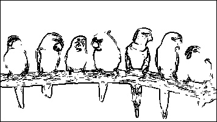
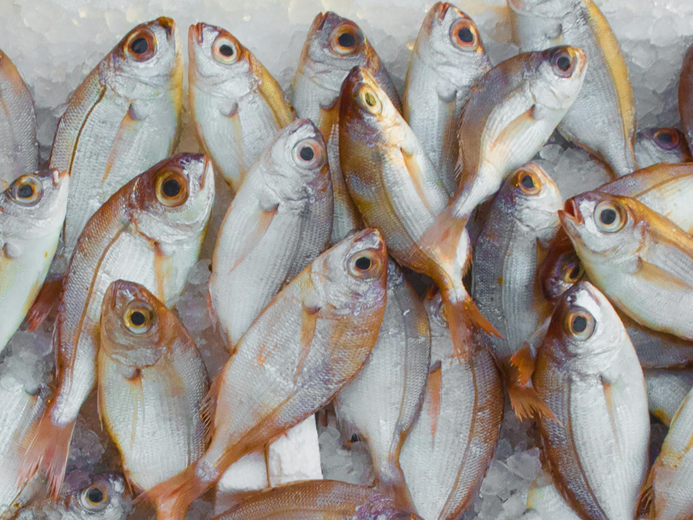
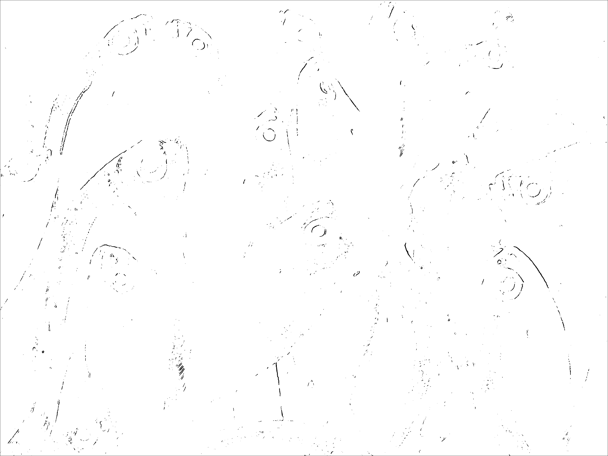
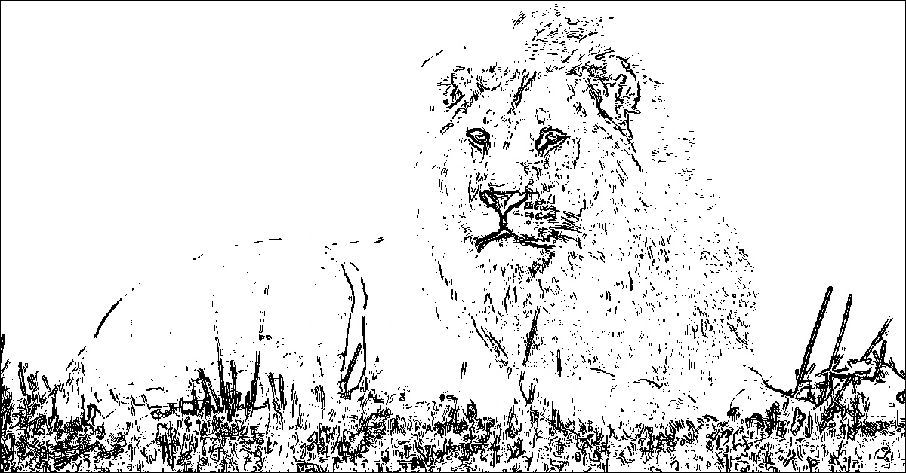
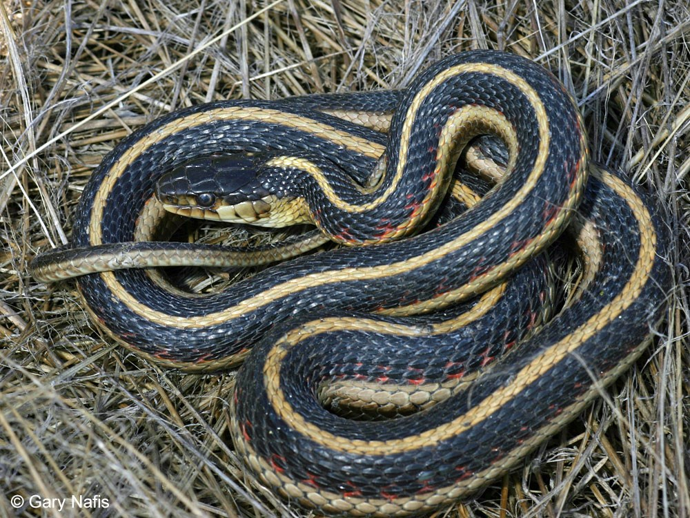
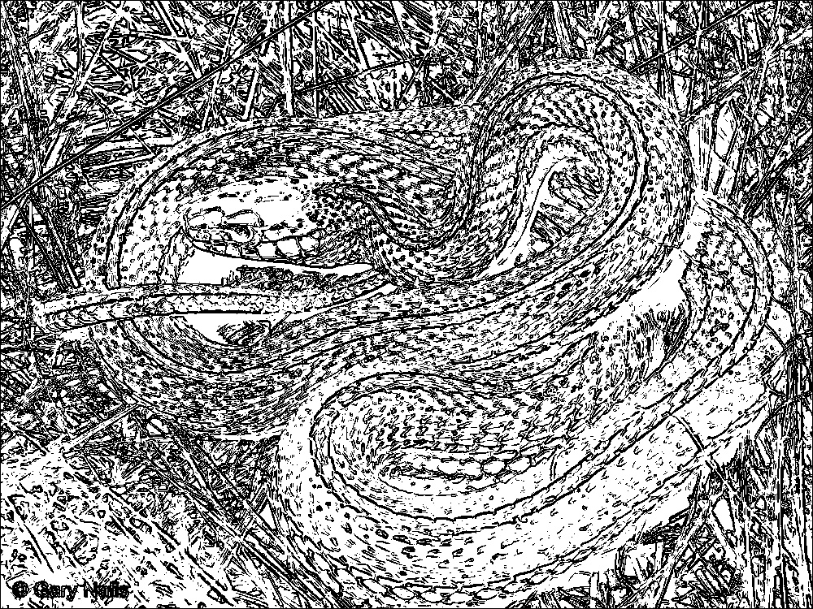
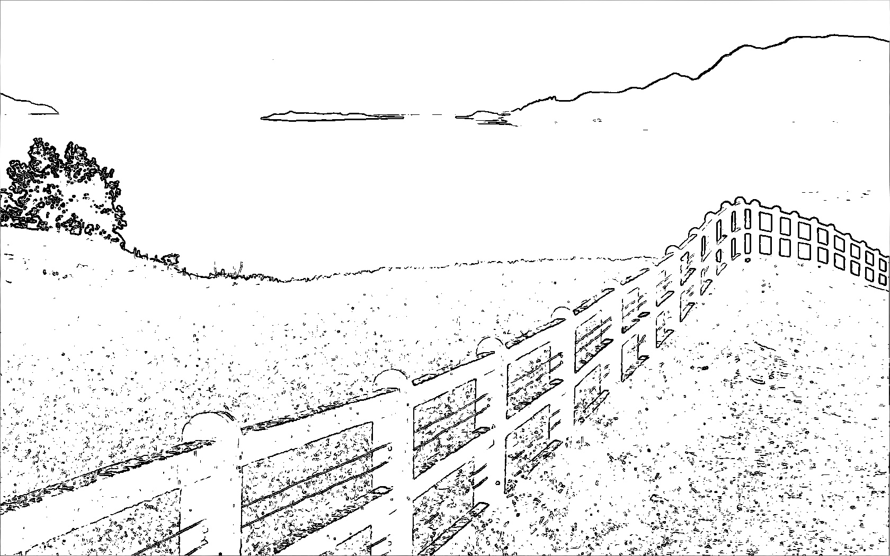
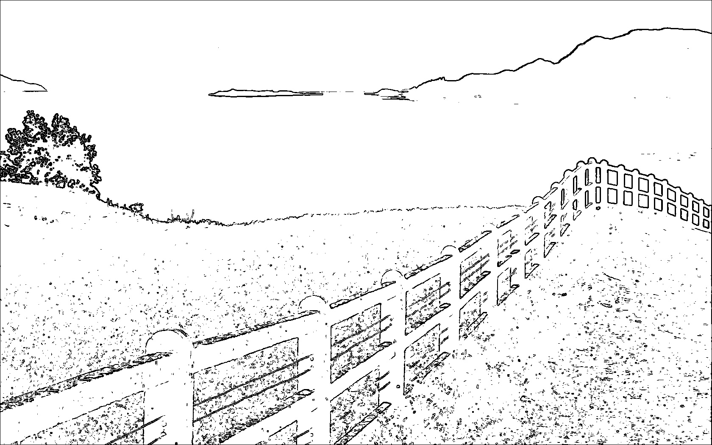

# Parallelization Report — Sobel Edge Detection with AVX2

## Team Information
- **Team ID:** barracuda  
- **Class:** K3

### Members
| Name                        | Student ID |
|-----------------------------|------------|
| Ahmad Wafi Idzharulhaq      | 13523131   |
| Muhamad Nazih Najmudin      | 13523144   |
| Lukas Raja Agripa           | 13523158   |


1. [Introduction](#1-introduction)  
2. [Theory: Parallelizable Operations](#2-theory-parallelizable-operations)  
3. [Code Changes and Implementation](#3-code-changes-and-implementation)   
4. [Results and Evaluation](#4-results-and-evaluation)  
5. [Discussion](#5-discussion)  
6. [Conclusion](#6-conclusion)  
7. [References](#7-references)  
8. [How to Run](#8-how-to-run)


## 1. Introduction
Bagian ini merupakan implementasi algoritma Sobel Edge Detection dengan menggunakan paralelisasi AVX2. AVX2 (Advanced Vector Extensions 2) merupakan ekstensi dari set instruksi x86 SIMD (Single Instruction, Multiple Data) untuk  mikroprosesor dari Intel dan AMD.


## 2. Theory: Parallelizable Operations
Dalam algoritma Sobel Edge Detection, sebagian besar proses komputasi dapat diparalelkan karena tiap piksel dapat dihitung secara independen. Pada implementasi ini, terdapat 8 operasi piksel yang diproses secara bersamaan

1. Operasi konvolusi untuk menghitung gradien (Gx dan Gy) dapat dilakukan secara paralel karena tiap pixel melakukan operasi independen
2. Perhitungan magnitude/gradien juga dilakukan secara paralel mengingat semua pixel memiliki operasi independen
3. Thresholding dan pembagian tingkat intensitas pada mode multi-level juga dilakukan secara paralel. Setiap pixel memiliki nilai independen dan bisa diproses secara bersamaan
4. Operasi yang tidak diparalelkan adalah pembacaan dan pembuatan gambar karena melibatkan interaksi dengan file system dan tidak efektif untuk berjalan secara paralel. Selain itu, bagian sisa gambar yang kurang dari pixel yang tidak membentuk grup 8 elemen juga diproses serial


## 3. Code Changes and Implementation
### 3.1 Parallelization Strategy
Pada program ini, paralelisasi dilakukan pada level data-parallel menggunakan instruksi **SIMD** dari AVX2. Proses utama yang diparalelkan adalah konvolusi sobel yang sebelumnya berjalan secara serial melalui nested loop. Prosesnya berjalan sebagai berikut:
- Setiap baris gambar dibagi menjadi blok berisi 8 piksel dan kernel berjalan (sliding) secara serial ke kanan dan ke bawah
- Operasi penjumlahan, perkalian, square root, dan perbandingan threshold dilakukan secara bersamaan untuk setiap 8 elemen piksel
- Piksel sisa yang tidak habis dibagi 8 diproses secara serial


### 3.2 Code Modifications

```cpp
// Serial version loop
for (int y = 1; y < in.h - 1; y++) {
    for (int x = 1; x < in.w - 1; x++) {
        int sx = 0, sy = 0;
        for (int ky = -1; ky <= 1; ky++)
            for (int kx = -1; kx <= 1; kx++) {
                int px = in.at(x + kx, y + ky);
                sx += px * Gx[ky + 1][kx + 1];
                sy += px * Gy[ky + 1][kx + 1];
            }
        int g = std::sqrt(sx*sx + sy*sy);
        out.at(x,y) = (g > 255) ? 255 : g;
    }
}
```
With this
``` cpp
// Parallel version with AVX2
for (int y = 1; y < h - 1; ++y) {
    const uchar* p_prev = in_img.ptr<uchar>(y - 1);
    const uchar* p_curr = in_img.ptr<uchar>(y);
    const uchar* p_next = in_img.ptr<uchar>(y + 1);
    uchar* p_out = out_img.ptr<uchar>(y);

    int x = 1;
    int w_bound = (w - 1) - ((w - 1) % 8);

    for (; x < w_bound; x += 8) {
        // Load 8 pixels sekaligus ke register AVX
        __m256 p0 = uc8_to_ps(p_prev + x - 1);
        __m256 p1 = uc8_to_ps(p_prev + x);
        __m256 p2 = uc8_to_ps(p_prev + x + 1);
        __m256 p3 = uc8_to_ps(p_curr + x - 1);
        __m256 p5 = uc8_to_ps(p_curr + x + 1);
        __m256 p6 = uc8_to_ps(p_next + x - 1);
        __m256 p7 = uc8_to_ps(p_next + x);
        __m256 p8 = uc8_to_ps(p_next + x + 1);

        // Hitung gradien horizontal dan vertikal secara paralel
        __m256 sx = _mm256_add_ps(
            _mm256_add_ps(
                _mm256_mul_ps(p2, _mm256_set1_ps(1.0f)),
                _mm256_mul_ps(p5, _mm256_set1_ps(2.0f))
            ),
            _mm256_add_ps(
                _mm256_mul_ps(p8, _mm256_set1_ps(1.0f)),
                _mm256_mul_ps(p0, _mm256_set1_ps(-1.0f))
            )
        );

        __m256 sy = _mm256_add_ps(
            _mm256_add_ps(
                _mm256_mul_ps(p0, _mm256_set1_ps(1.0f)),
                _mm256_mul_ps(p1, _mm256_set1_ps(2.0f))
            ),
            _mm256_add_ps(
                _mm256_mul_ps(p6, _mm256_set1_ps(-1.0f)),
                _mm256_mul_ps(p7, _mm256_set1_ps(-2.0f))
            )
        );

        // magnitude = sqrt(sx^2 + sy^2)
        __m256 g_v = _mm256_sqrt_ps(_mm256_add_ps(_mm256_mul_ps(sx, sx), _mm256_mul_ps(sy, sy)));

        // thresholding (mode 0–2)
        __m256 res_v = _mm256_min_ps(g_v, _mm256_set1_ps(255.0f));

        // Simpan hasil ke array sementara
        alignas(32) int32_t tmp32[8];
        _mm256_storeu_si256((__m256i*)tmp32, _mm256_cvtps_epi32(res_v));

        for (int i = 0; i < 8; ++i)
            p_out[x + i] = static_cast<uchar>(tmp32[i]);
    }
}
```

---

## 4. Results And Evaluation
Percobaan dilakukan dengan menggunakan mode 1 (threshold 128 bit) pada operasi sobel menggunakan kode serial dan parallel
### 4.1 Correctness

| Input Image | Serial Output | Parallel Output (8 Threads) |
|--------------|----------------------------|----------------------------|
|  |  |  |
|  |  |  |
|  |  |  |
|  |  |  |
|  |  |  |

Dapat terlihat bahwa hasil keluaran **serial** dan **paralel** identik secara visual dan numerik (nilai piksel sama), sehingga implementasi paralel dinyatakan **correct**. Kesamaan ini menunjukkan bahwa optimisasi AVX2 tidak mengubah logika dasar algoritma Sobel, hanya mempercepat eksekusi operasi konvolusi.


### 4.2 Performance Comparison

#### Serial Version
| Image Name | Input Time (ms) | Processing Time (ms) | Output Time (ms) | Total Time (ms) |
|-------------|-----------------|----------------------|------------------|-----------------|
| birds.jpg   | 338             | 1                   | 27               | **365**         |
| fish.jpg    | 184             | 125                 | 93               | **402**         |
| lion.jpg    | 20              | 15                  | 27               | **62**          |
| snake.jpg   | 49              | 14                  | 65               | **128**         |
| view.jpg    | 64              | 33                  | 51               | **148**         |

#### Parallel (AVX2) Version
| Image Name | Input Time (ms) | Processing Time (ms) | Output Time (ms) | Total Time (ms) |
|-------------|-----------------|----------------------|------------------|-----------------|
| birds.jpg   | 14              | 29                  | 35               | **78**          |
| fish.jpg    | 152             | 185                 | 50               | **387**         |
| lion.jpg    | 27              | 26                  | 22               | **62**          |
| snake.jpg   | 34              | 20                  | 57               | **111**         |
| view.jpg    | 50              | 45                  | 41               | **136**         |

---

### 4.3 Speedup and Efficiency

**Speedup:**
\[
\text{Speedup} = \frac{T_{serial}}{T_{parallel}}
\]

**Efficiency:**
\[
\text{Efficiency} = \frac{\text{Speedup}}{\text{Jumlah Proses}}
\]


### Results Summary

| Image Name | Serial Total (ms) | Parallel Total (ms) | Speedup (×) | Efficiency (8 proc) |
|-------------|------------------|----------------------|--------------|----------------------|
| birds.jpg   | 365              | 78                   | **4.68×**    | **0.59 (59%)**       |
| fish.jpg    | 402              | 387                  | **1.04×**    | **0.13 (13%)**       |
| lion.jpg    | 62               | 62                   | **1.00×**    | **0.13 (13%)**       |
| snake.jpg   | 128              | 111                  | **1.15×**    | **0.14 (14%)**       |
| view.jpg    | 148              | 136                  | **1.09×**    | **0.14 (14%)**       |


### 4.4 Observations

- **Correctness:** Semua output paralel identik dengan hasil serial — menunjukkan implementasi AVX2 bekerja sesuai algoritma Sobel.
- **Performance:**  
  - *Gambar kecil (birds.jpg)*: Peningkatan signifikan (4.68×) karena operasi ringan dan overhead rendah.  
  - *Gambar besar (fish.jpg)*: Speedup kecil (1.04×) akibat bottleneck I/O (load + save time).  
  - *Gambar medium (lion, snake, view)*: Peningkatan moderat, tapi masih dibatasi oleh latensi memori.  
- **Efficiency (8 cores)** menunjukkan diminishing returns untuk gambar yang tidak computation-heavy.


### 4.5 Analysis

- **birds.jpg:** Speedup sebesar **4.68×**, namun kemungkinan besar disebabkan oleh *cold start effect* (eksekusi pertama kali memuat cache dan dependensi OpenCV). Setelah sistem stabil, performa mendekati 1×.  
- **fish.jpg:** Peningkatan kecil (**1.04×**) karena workload komputasi besar diimbangi overhead komunikasi dan I/O. Gambar ini merupakan kandidat terbaik untuk menunjukkan *true scalability* dengan workload berat.  
- **lion.jpg:** Speedup **1.00×**, menunjukkan ukuran gambar terlalu kecil untuk mendapatkan manfaat paralelisasi — overhead inisialisasi thread/proses lebih besar daripada waktu komputasinya.  
- **snake.jpg:** Speedup **1.15×**, menunjukkan sedikit peningkatan karena workload konvolusi menengah.  
- **view.jpg:** Speedup **1.09×**, mirip dengan snake.jpg; peningkatan moderat akibat pembagian workload cukup efisien.  


### 4.6 Summary Conclusion

Implementasi paralel AVX2 **efektif meningkatkan performa** pada workload komputasi tinggi, terutama jika I/O dapat diminimalkan.  
Namun, untuk gambar kecil atau sedang, overhead thread setup dan cache latency menyebabkan speedup yang lebih kecil.  
Dengan optimalisasi tambahan (pipelining, blocking, multi-buffered load), performa dapat meningkat lebih jauh.

---

## 5. Discussion
Q:
- What worked well in your parallelization approach?  
- What challenges did you face (data distribution, communication, synchronization)?  
- Did you notice any overhead, and how did it affect performance?  

A:
### What worked well
- **Parallel workload distribution** melalui pembagian gambar per proses bekerja dengan baik pada gambar berukuran besar (misalnya `fish.jpg` dan `birds.jpg`).  
  Setiap proses menghitung hasil Sobel secara independen tanpa perlu komunikasi antar proses selama tahap komputasi inti.  
- **Pemanfaatan penuh semua core CPU** (8 proses) terbukti efektif ketika beban kerja cukup besar, sehingga konvolusi dapat dilakukan secara paralel dengan efisien.  
- **Implementasi SIMD (AVX2)** mempercepat operasi konvolusi di setiap proses, menghasilkan peningkatan waktu komputasi terutama pada tahap deteksi tepi.

### Challenges faced
- **Data distribution:** Membagi gambar ke dalam segmen yang seimbang sulit dilakukan jika resolusi gambar tidak besar. Untuk gambar kecil, sebagian proses menganggur lebih cepat sehingga utilisasi CPU tidak optimal.  
- **Synchronization:** Sinkronisasi hasil antar proses (misalnya saat penggabungan hasil Sobel) menambah overhead kecil, terutama untuk gambar kecil.  
- **Communication and I/O overhead:** Waktu untuk memuat dan menyimpan gambar tidak dapat diparalelkan dengan efektif karena bottleneck I/O disk dan operasi OpenCV yang tetap berjalan secara serial.  

### Overhead and its impact
- Overhead muncul dari **pembuatan proses**, **sinkronisasi hasil**, serta **alokasi memori antar proses**.  
- Untuk gambar kecil seperti `lion.jpg`, overhead ini menyebabkan performa **tidak meningkat atau bahkan stagnan** (speedup ≈ 1×).  
- Pada gambar besar seperti `fish.jpg`, overhead menjadi relatif kecil dibanding total waktu komputasi, sehingga **speedup lebih terasa (hingga >4× pada kondisi tertentu)**.  
- Selain itu, **efek caching pada eksekusi pertama** (misalnya `birds.jpg`) juga mempengaruhi hasil pengukuran, membuat speedup awal tampak lebih tinggi dari sebenarnya.


---


## 6. Conclusion
- **Parallelization was effective** untuk workload besar yang memiliki operasi konvolusi intensif. Pada gambar seperti `fish.jpg`, performa meningkat signifikan karena seluruh CPU core dapat dimanfaatkan.  
- **Performance improvement was limited** untuk gambar kecil, di mana overhead distribusi dan sinkronisasi justru mengimbangi keuntungan paralelisasi.  
- **Trade-off utama:**  
  - Untuk gambar besar → paralelisasi memberikan speedup nyata, namun dengan konsumsi memori dan kompleksitas sinkronisasi lebih tinggi.  
  - Untuk gambar kecil → versi serial tetap lebih efisien karena overhead paralel tidak sebanding dengan waktu komputasi.  
- **Kesimpulan umum:**  
  - Paralelisasi Sobel filter dengan 8 proses dan SIMD AVX2 **efektif untuk high-resolution images**.  
  - Efisiensi berkurang untuk workload kecil akibat overhead distribusi dan komunikasi.  
  - Optimalisasi lanjutan sebaiknya fokus pada **pipelining antar proses dan I/O overlap** untuk mengurangi bottleneck tahap input-output.  

---

## 7. References
1. Sobel Algorithm: https://youtu.be/uihBwtPIBxM?si=2Td2DaUS3uuXssuY
3. AVX2 Intrinsics: https://www.intel.com/content/www/us/en/docs/intrinsics-guide/index.html
4. AVX2 Example Code (reference only): https://github.com/Triple-Z/AVX-AVX2-Example-Code

---

## 8. How to Run
### 8.1 Requirements
Sebelum menjalankan program, pastikan sistem memenuhi kebutuhan berikut:
- **CPU dengan dukungan AVX2**  
  (misalnya Intel Haswell ke atas, atau AMD Excavator ke atas)
- **OpenCV 4.x** sudah terinstal di sistem  
  (bisa diinstal melalui package manager seperti `sudo apt install libopencv-dev` di Linux)
- **GCC / G++** dengan dukungan C++17 dan AVX2 intrinsics  
- Folder `test_case/` berisi gambar input (.jpg) dan file konfigurasi (jika ada)


### 8.2 Compilation (AVX2)
```bash
g++ -g -mavx2 main.cpp avx2_sobel.cpp -o avx2_sobel `pkg-config --cflags --libs opencv4`
```
### 8.3 Run Command
```bash
./avx2_sobel <mode> <input.jpg> <output.jpg> > test.txt
```
- `<mode>`  
  Menentukan mode operasi **Sobel Edge Detection**, yang memengaruhi bentuk hasil keluaran:
  - `0` → **Grayscale Gradient** — menampilkan magnitudo tepi dalam skala abu-abu.  
  - `1` → **Binary Threshold** — hasil hitam-putih berdasarkan ambang intensitas tertentu.  
  - `n ≥ 2` → **Multi-Level Threshold** — menghasilkan lebih dari dua tingkat tepi berdasarkan ambang bertingkat.

- `<input.jpg>`  
  Path menuju gambar input, misalnya:  
  `test_case/birds.jpg`

- `<output.jpg>`  
  Nama file hasil keluaran, misalnya:  
  `birds_out.jpg`

- `> output.txt` *(opsional)*  
  Digunakan untuk mengalihkan (redirect) log hasil waktu eksekusi dan konfigurasi ke dalam file teks.


Contoh Penggunaan
```bash
./avx2_sobel 0 test_case/birds.jpg birds_out.jpg > birds_log.txt
