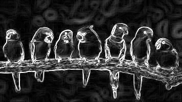
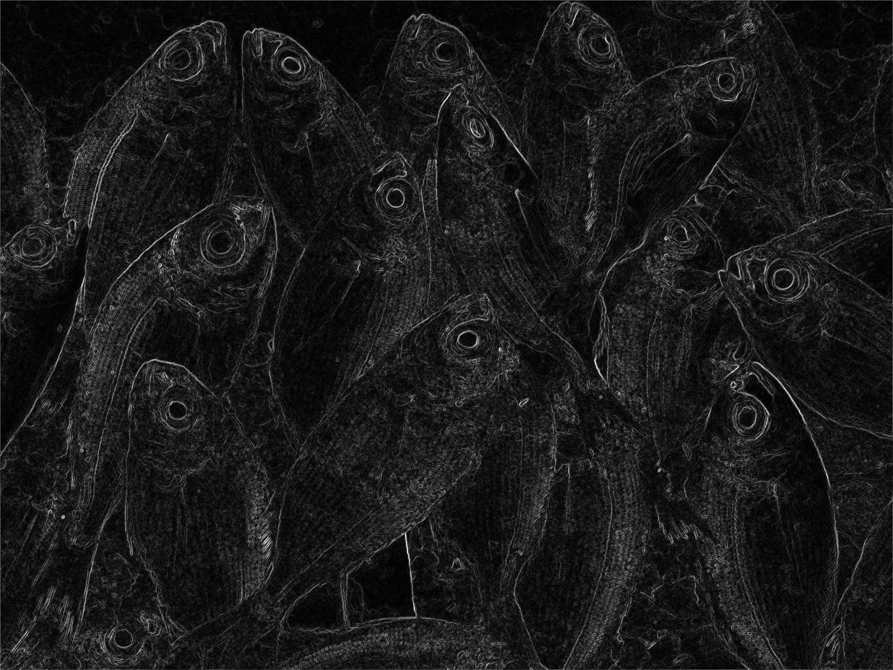
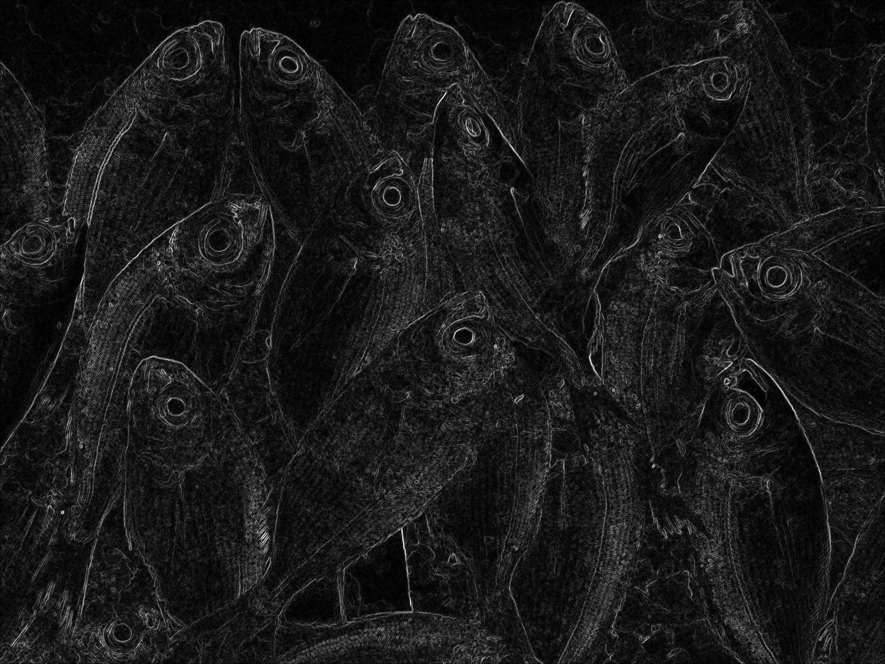
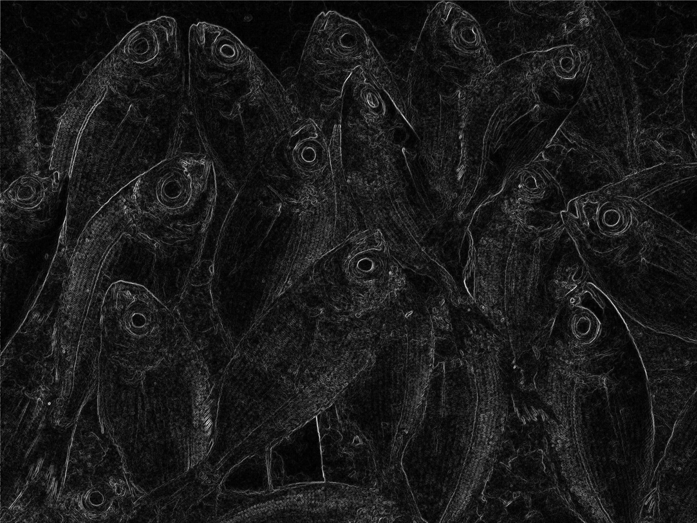
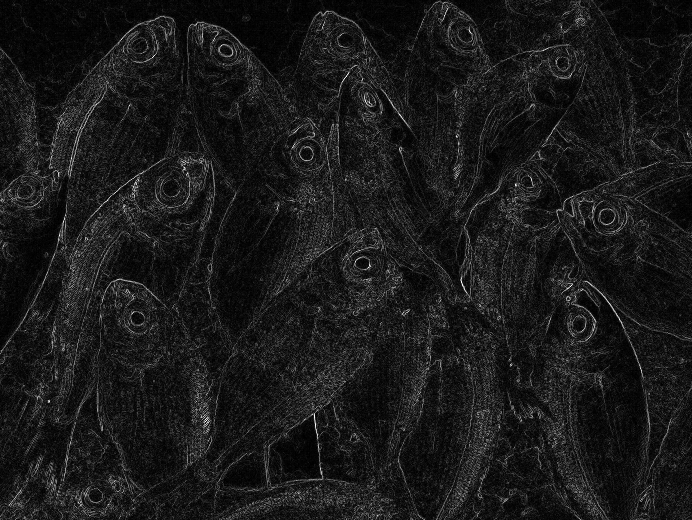
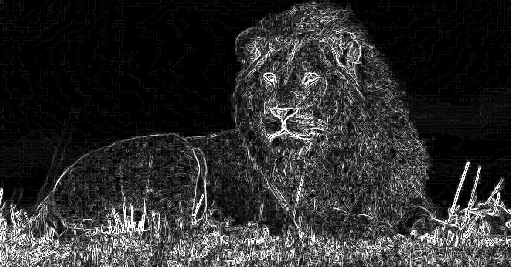
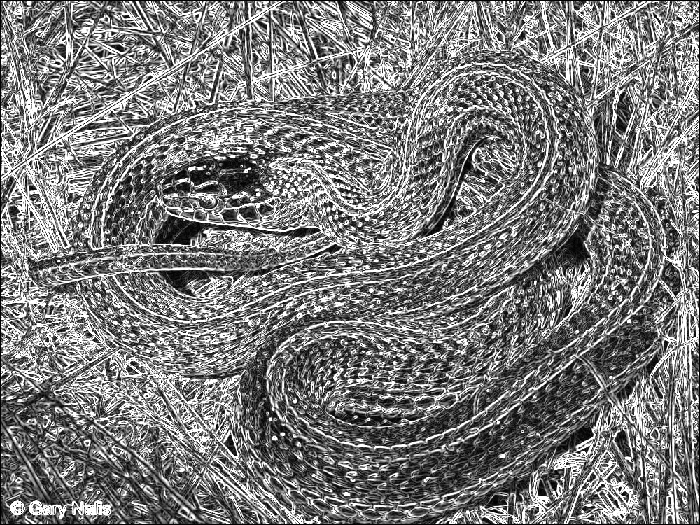
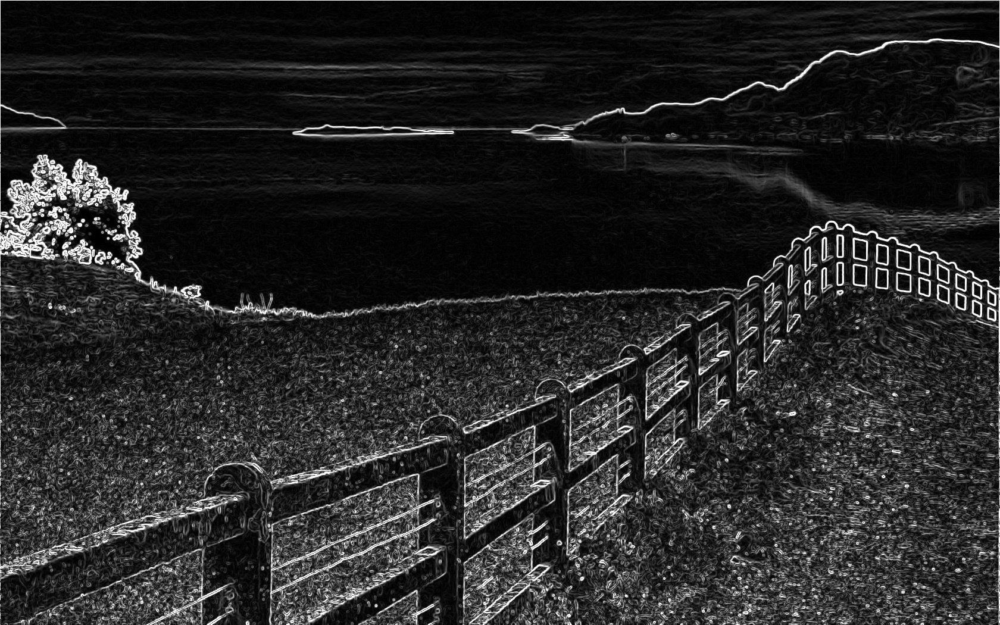

# Parallelization Report — Sobel Edge Detection with CUDA

## Team Information
- **Team ID :**  barracuda
- **Class   :**  K3

### Members
| Name                      | Student ID      |
|---------------------------|-----------------|
| Ahmad Wafi Idzharulhaq    | 13523131        |
| Muhamad Nazih Najmudin    | 13523144        |
| Lukas Raja Agripa         | 13523158        |


## List of Contents
1. [Introduction](#1-introduction)  
2. [Theory: Parallelizable Operations](#2-theory-parallelizable-operations)  
3. [Code Changes and Implementation](#3-code-changes-and-implementation)  
4. [Results and Evaluation](#4-results-and-evaluation)  
   - [Correctness](#41-correctness)  
   - [Performance Comparison](#42-performance-comparison)  
   - [Speedup and Efficiency](#43-speedup-and-efficiency)  
5. [Discussion](#5-discussion)  
6. [Conclusion](#6-conclusion)  
7. [Additional Notes (Optional)](#7-additional-notes-optional)  
8. [References](#8-references)  
9. [How to Run](#9-how-to-run)  


## 1. Introduction
Tugas ini bertujuan untuk mengimplementasikan paralelisasi algoritma Sobel Edge Detection menggunakan CUDA. Sobel Edge Detection adalah algoritma pengolahan citra yang digunakan untuk mendeteksi tepi (edge) pada gambar dengan menerapkan operator konvolusi menggunakan kernel Sobel.

Algoritma Sobel bekerja dengan menghitung gradien intensitas gambar menggunakan dua kernel 3x3 untuk mendeteksi perubahan horizontal dan vertikal. Hasil dari kedua gradien tersebut dikombinasikan untuk menghasilkan magnitude gradien yang kemudian dibandingkan dengan threshold untuk menentukan apakah suatu pixel merupakan tepi atau bukan.

Tujuan dari penerapan paralelisasi dengan CUDA adalah untuk meningkatkan performa komputasi dengan memanfaatkan GPU. CUDA memungkinkan pembagian beban kerja komputasi setiap pixel secara paralel, sehingga harapannya waktu pemrosesan dapat berkurang secara signifikan dibandingkan dengan implementasi serial.


## 2. Theory: Parallelizable Operations
Pada kasus ini, operasi dan fungsi yang dapat diparalelisasi adalah:
- Perhituangn konvolusi piksel-piksel dalam algoritma Sobel bersifat independen dan dapat didistribusikan ke seluruh proses.  
- Perhitunagn gradien dan threshold dapat dihitung secara paralel karena setiap piksel bersifat independen.  
- Grayscaling gambar sebetulnya juga dapat diparalelisasi, tetapi kata asisten harus pakai cv::IMREAD_GRAYSCALE


## 3. Code Changes and Implementation
### 3.1 Parallelization Strategy
Paralelisasi dengan CUDA bekerja dengan membagi setiap pemrosesan sebuah piksel gambar ke dalam thread-thread berbeda. Setiap pemrosesan piksel bersifat independen, sehingga seluruh proses mencakup konvolusi dan perhitungan gradien untuk setiap piksel dilakukan pada setiap CUDA thread. 

Strategi Optimasi Overhead:
- Mencari ukuran dimensi block dan dimensi grid yang tepat berdasarkan kemampuan GPU user.
- Pembagian block mengikuti aturan persegi dengan ukuran kelipatan warp size.
- Penyalinan data dari CPU ke GPU relatif mahal, sehingga cudaMalloc dipanggil se-sedikit mungkin. Selain itu juga dioptimasi dengan pinned memory.
- Akses global memory diminimasi dengan membuat shared memory.

### 3.2 Code Modifications
Paralelisasi ini mengubah perhitungan nested loop menjadi kernel CUDA. Serta mengubah perhitungan konvolusi menjadi unroll version.

**Before:**
```cpp
// Serial version loop
    int Gx[3][3]={{-1,0,1},{-2,0,2},{-1,0,1}};
    int Gy[3][3]={{1,2,1},{0,0,0},{-1,-2,-1}};
    Image out=in;

    for(int y=1;y<in.h-1;y++){
        for(int x=1;x<in.w-1;x++){
            int sx=0, sy=0;
            for(int ky=-1; ky<=1; ky++)
                for(int kx=-1; kx<=1; kx++){
                    int px=in.at(x+kx,y+ky);
                    sx += px * Gx[ky+1][kx+1];
                    sy += px * Gy[ky+1][kx+1];
                }
            int g = std::sqrt(sx*sx + sy*sy);

            ...
        }
    }
```

**After:**
``` cpp
// Parallel version with CUDA (sobel_kernel without shared memory)
    int x = blockIdx.x * blockDim.x + threadIdx.x;
    int y = blockIdx.y * blockDim.y + threadIdx.y;
    if (x >= w || y >= h) return;
    x++; y++;

    // Convolution
    int ver = 0, hor = 0;
    if (x > 0 && x < w-1 && y > 0 && y < h-1) {
        ver = in[(y+1)*w + (x-1)] + 2*in[(y+1)*w + x] + in[(y+1)*w + (x+1)]
        - (in[(y-1)*w + (x-1)] + 2*in[(y-1)*w + x] + in[(y-1)*w + (x+1)]);
        hor = in[(y-1)*w + (x+1)] + 2*in[y*w + (x+1)] + in[(y+1)*w + (x+1)]
        - (in[(y-1)*w + (x-1)] + 2*in[y*w + (x-1)] + in[(y+1)*w + (x-1)]);
    }
    int g = (int)sqrtf(ver*ver + hor*hor);
```

Contoh tersebut merupakan perubahan untuk tipe kernel cuda tanpa shared memory. Untuk implementasi shared memory, terdapat dua versi yaitu versi dengan static block size (16 x 16) dan versi dengan runtime block size (ditentukan oleh fungsi get_optimal_config yang mencari konfigurasi dimensi grid dan blok terbaik sesuai spesifikasi GPU)

**Static Block Sized Shared Memory Kernel:**
``` cpp
__global__ void kernel_sobel_shared(unsigned char *in, unsigned char *out, int w, int h, int mode, int *d_thresholds) {
    __shared__ unsigned char tile[BLOCK_SIZE + 2][BLOCK_SIZE + 2];

    int tx = threadIdx.x;
    int ty = threadIdx.y;
    int x = blockIdx.x * BLOCK_SIZE + tx;
    int y = blockIdx.y * BLOCK_SIZE + ty;

    // Global index
    int gx = min(max(x, 0), w - 1);
    int gy = min(max(y, 0), h - 1);

    // Load main pixel
    tile[ty + 1][tx + 1] = in[gy * w + gx];

    // Load halo region (edges of tile)
    if (tx == 0 && gx > 0)
        tile[ty + 1][0] = in[gy * w + gx - 1];
    if (tx == BLOCK_SIZE - 1 && gx < w - 1)
        tile[ty + 1][BLOCK_SIZE + 1] = in[gy * w + gx + 1];
    if (ty == 0 && gy > 0)
        tile[0][tx + 1] = in[(gy - 1) * w + gx];
    if (ty == BLOCK_SIZE - 1 && gy < h - 1)
        tile[BLOCK_SIZE + 1][tx + 1] = in[(gy + 1) * w + gx];

    // Load corners (optional, for correctness)
    if (tx == 0 && ty == 0 && gx > 0 && gy > 0)
        tile[0][0] = in[(gy - 1) * w + gx - 1];
    if (tx == BLOCK_SIZE - 1 && ty == 0 && gx < w - 1 && gy > 0)
        tile[0][BLOCK_SIZE + 1] = in[(gy - 1) * w + gx + 1];
    if (tx == 0 && ty == BLOCK_SIZE - 1 && gx > 0 && gy < h - 1)
        tile[BLOCK_SIZE + 1][0] = in[(gy + 1) * w + gx - 1];
    if (tx == BLOCK_SIZE - 1 && ty == BLOCK_SIZE - 1 &&
        gx < w - 1 && gy < h - 1)
        tile[BLOCK_SIZE + 1][BLOCK_SIZE + 1] = in[(gy + 1) * w + gx + 1];

    __syncthreads();

    // Skip border threads
    if (x >= w || y >= h) return;

    // Sobel filter (pakai tile)
    int ver =
        tile[ty + 2][tx] + 2 * tile[ty + 2][tx + 1] + tile[ty + 2][tx + 2] -
        (tile[ty][tx] + 2 * tile[ty][tx + 1] + tile[ty][tx + 2]);
    int hor =
        tile[ty][tx + 2] + 2 * tile[ty + 1][tx + 2] + tile[ty + 2][tx + 2] -
        (tile[ty][tx] + 2 * tile[ty + 1][tx] + tile[ty + 2][tx]);
    int g = (int)sqrtf(ver * ver + hor * hor);
```

**Optimize Block Sized Shared Memory Kernel:**
``` cpp
__global__ void kernel_sobel_tiled(const unsigned char* __restrict__ in, unsigned char* out,
                        int w, int h, int mode, const int* d_thresholds) {
    const int BX = blockDim.x;
    const int BY = blockDim.y;
    const int sW = BX + 2;   // shared width (cols)
    const int sH = BY + 2;   // shared height (rows)
    extern __shared__ unsigned char s[]; // size: sW * sH

    int tx = threadIdx.x;
    int ty = threadIdx.y;
    int bx = blockIdx.x;
    int by = blockIdx.y;

    int x = bx * BX + tx;  // global x for this thread
    int y = by * BY + ty;  // global y for this thread

    int tid = ty * BX + tx;
    int totalThreads = BX * BY;
    int elems = sW * sH;

    // Linearized load (each thread loads multiple elements of shared tile)
    for (int i = tid; i < elems; i += totalThreads) {
        int sm_y = i / sW;
        int sm_x = i % sW;
        int glob_x = bx * BX + (sm_x - 1); // -1 because sm_x=0 is left
        int glob_y = by * BY + (sm_y - 1); // -1 because sm_y=0 is top

        // clamp to image border
        glob_x = (glob_x < 0) ? 0 : ( (glob_x >= w) ? (w-1) : glob_x );
        glob_y = (glob_y < 0) ? 0 : ( (glob_y >= h) ? (h-1) : glob_y );

        s[i] = in[glob_y * w + glob_x];
    }

    __syncthreads();

    if (x >= w || y >= h) return;

    // center in shared coords
    int c_x = tx + 1;
    int c_y = ty + 1;
    // int idx_center = c_y * sW + c_x;

    int ver =
        s[(c_y+1)*sW + (c_x-1)] + 2*s[(c_y+1)*sW + c_x] + s[(c_y+1)*sW + (c_x+1)]
      - (s[(c_y-1)*sW + (c_x-1)] + 2*s[(c_y-1)*sW + c_x] + s[(c_y-1)*sW + (c_x+1)]);
    int hor =
        s[(c_y-1)*sW + (c_x+1)] + 2*s[c_y*sW + (c_x+1)] + s[(c_y+1)*sW + (c_x+1)]
      - (s[(c_y-1)*sW + (c_x-1)] + 2*s[c_y*sW + (c_x-1)] + s[(c_y+1)*sW + (c_x-1)]);

    int g = (int)sqrtf((float)(ver*ver + hor*hor));
```


## 4. Results and Evaluation

### 4.1 Correctness

| Input Image | Serial        | CUDA (biasa)    | CUDA (shared 16x16) | CUDA (shared optimized block dim) |
|-------------|---------------|-----------------|---------------------|-----------------------------------|
|  |  |  |  |  |
|  |  |  |  |  |
|  |  |  |  |  |
|  |  |  |  |  |
|  |  |  |  |  |


### 4.2 Performance Comparison

#### Serial Version

| Image Name   |   Input Time (ms) |   Processing Time (ms) |   Output Time (ms) |   Total Time (ms) |
|:-------------|------------------:|-----------------------:|-------------------:|------------------:|
| birds.jpg    |                65 |                      4 |                 23 |                92 |
| fish.jpg     |               273 |                    477 |                489 |              1239 |
| lion.jpg     |                32 |                     47 |                 90 |               169 |
| snake.jpg    |                87 |                     59 |                143 |               289 |
| view.jpg     |                85 |                    128 |                222 |               435 |


#### Parallel Version

| Image Name   | Kernel Type   |   Input Time (ms) |   Processing Time (ms) |   Output Time (ms) |   Total Time (ms) |
|:-------------|:--------------|------------------:|-----------------------:|-------------------:|------------------:|
| birds.jpg    | raw-d         |                18 |                     10 |                 24 |                52 |
| birds.jpg    | raw-s         |                24 |                      9 |                 17 |                50 |
| birds.jpg    | shared-d      |                12 |                     16 |                 22 |                50 |
| birds.jpg    | shared-s      |                21 |                      9 |                 13 |                43 |
| fish.jpg     | raw-d         |               203 |                     26 |                637 |               866 |
| fish.jpg     | raw-s         |               220 |                     16 |                440 |               676 |
| fish.jpg     | shared-d      |               279 |                     14 |                557 |               850 |
| fish.jpg     | shared-s      |               304 |                     37 |                449 |               790 |
| lion.jpg     | raw-d         |                34 |                     17 |                100 |               151 |
| lion.jpg     | raw-s         |                14 |                      6 |                 48 |                68 |
| lion.jpg     | shared-d      |                28 |                     15 |                116 |               159 |
| lion.jpg     | shared-s      |                35 |                      9 |                 99 |               143 |
| snake.jpg    | raw-d         |                97 |                     10 |                147 |               254 |
| snake.jpg    | raw-s         |               113 |                      7 |                103 |               223 |
| snake.jpg    | shared-d      |                56 |                      8 |                113 |               177 |
| snake.jpg    | shared-s      |                88 |                      6 |                 69 |               163 |
| view.jpg     | raw-d         |                65 |                     14 |                104 |               183 |
| view.jpg     | raw-s         |                94 |                     10 |                164 |               268 |
| view.jpg     | shared-d      |               162 |                      6 |                140 |               308 |
| view.jpg     | shared-s      |                87 |                      9 |                165 |               261 |

**Keterangan:**
- raw = tanpa shared memory
- shared = dengan shared memory
- d = block size ditentukan saat runtime dengan get_optimal_config (NVIDIA RTX 4050 = 32 x 16)
- s = block size ditentukan di awal = 16 x 16


### 4.3 Speedup and Efficiency
- **Speedup** = Serial Time / Parallel Time  
- **Efficiency** = Speedup / Number of Processes  

| Image Type   | Kernel Type   |   Serial Time |   Parallel Time |   SpeedUp (all program) |   Serial Proc Time |   Parallel Proc Time |   SpeedUp (sobel only) |
|:-------------|:--------------|--------------:|----------------:|------------------------:|-------------------:|---------------------:|-----------------------:|
| birds.jpg    | raw-d         |            92 |              52 |                   1.769 |                  4 |                   10 |                  0.4   |
| birds.jpg    | raw-s         |            92 |              50 |                   1.84  |                  4 |                    9 |                  0.444 |
| birds.jpg    | shared-d      |            92 |              50 |                   1.84  |                  4 |                   16 |                  0.25  |
| birds.jpg    | shared-s      |            92 |              43 |                   2.14  |                  4 |                    9 |                  0.444 |
| fish.jpg     | raw-d         |          1239 |             866 |                   1.431 |                477 |                   26 |                 18.346 |
| fish.jpg     | raw-s         |          1239 |             676 |                   1.833 |                477 |                   16 |                 29.812 |
| fish.jpg     | shared-d      |          1239 |             850 |                   1.458 |                477 |                   14 |                 34.071 |
| fish.jpg     | shared-s      |          1239 |             790 |                   1.568 |                477 |                   37 |                 12.892 |
| lion.jpg     | raw-d         |           169 |             151 |                   1.119 |                 47 |                   17 |                  2.765 |
| lion.jpg     | raw-s         |           169 |              68 |                   2.485 |                 47 |                    6 |                  7.833 |
| lion.jpg     | shared-d      |           169 |             159 |                   1.063 |                 47 |                   15 |                  3.133 |
| lion.jpg     | shared-s      |           169 |             143 |                   1.182 |                 47 |                    9 |                  5.222 |
| snake.jpg    | raw-d         |           289 |             254 |                   1.138 |                 59 |                   10 |                  5.9   |
| snake.jpg    | raw-s         |           289 |             223 |                   1.296 |                 59 |                    7 |                  8.429 |
| snake.jpg    | shared-d      |           289 |             177 |                   1.633 |                 59 |                    8 |                  7.375 |
| snake.jpg    | shared-s      |           289 |             163 |                   1.773 |                 59 |                    6 |                  9.833 |
| view.jpg     | raw-d         |           435 |             183 |                   2.377 |                128 |                   14 |                  9.143 |
| view.jpg     | raw-s         |           435 |             268 |                   1.623 |                128 |                   10 |                 12.8   |
| view.jpg     | shared-d      |           435 |             308 |                   1.412 |                128 |                    6 |                 21.333 |
| view.jpg     | shared-s      |           435 |             261 |                   1.667 |                128 |                    9 |                 14.222 |

### 4.4 Observations

### A. Correctness
Semua output paralel identik dengan hasil serial. Hal ini menunjukkan bahwa semua implementasi kernel CUDA (biasa, shared memory 16x16, dan shared memory optimized block dim) berfungsi dengan benar dan menghasilkan hasil edge detection Sobel yang sesuai dengan algoritma versi serial.
### B. Performance
Perbandingan waktu menunjukkan bahwa versi Paralel (CUDA) secara konsisten lebih cepat dalam Processing Time (waktu pemrosesan kernel) dibandingkan dengan versi Serial, terutama untuk citra yang lebih besar/membutuhkan waktu pemrosesan serial yang lama.
* **Pengurangan Waktu Pemrosesan Kernel**
    - Pada citra fish.jpg (waktu pemrosesan serial tertinggi 477 ms), waktu pemrosesan paralel anjlok signifikan menjadi antara 14 ms hingga  37 ms.
    - Pada citra view.jpg (waktu pemrosesan serial 128 ms), waktu pemrosesan paralel berada di antara 6 ms hingga 14 ms.
    - Bahkan pada citra kecil - seperti birds.jpg (waktu pemrosesan serial hanya 4 ms), waktu pemrosesan paralel masih relatif kecil, meskipun percepatan totalnya tidak terlalu terlihat karena waktu serial yang sudah sangat singkat.
* **Pengaruh Optimasi CUDA Kernel**
    - Secara umum, implementasi shared dan raw menunjukkan waktu pemrosesan yang serupa, dengan shared seringkali sedikit lebih cepat atau sebanding (misalnya, fish.jpg shared-d 14 ms vs raw-s 16 ms, atau view.jpg shared-d 6 ms vs raw-d 14 ms).
    - Untuk beberapa citra besar (fish.jpg, view.jpg), optimasi shared memory (shared-d atau shared-s) memberikan waktu pemrosesan kernel yang terendah, menunjukkan bahwa shared memory berhasil mengurangi latensi memori.
    - Pengaruh ukuran blok (d optimal vs s 16 x 16) tidak konsisten. Misalnya, untuk fish.jpg, shared-d (14 ms) sedikit lebih cepat daripada shared-s (37 ms), sedangkan untuk view.jpg, shared-d (6 ms) jauh lebih cepat daripada shared-s (9 ms).
* **Total Waktu Program**
    - Total waktu program (Input + Processing + Output) untuk versi Paralel jauh lebih rendah daripada Serial untuk citra besar (fish.jpg: 1239 ms serial vs 676 ms paralel terbaik; view.jpg: 435 ms serial vs 183 ms paralel terbaik), namun masih didominasi oleh waktu Input dan Output (data transfer dari CPU ke GPU dan sebaliknya, serta loading/saving JPG).

### 4.5 Analysis
Perhitungan SpeedUp mengonfirmasi observasi performa, namun memberikan pemahaman lebih mendalam tentang efektivitas paralelisasi.
* **SpeedUp**
    - SpeedUp pada waktu pemrosesan kernel saja sangat besar, terutama pada citra yang lebih besar atau kompleks seperti fish.jpg, mencapai hingga 34.071 x (shared-d). Hal ini menunjukkan bahwa algoritma pemrosesan yang diparalelkan (filter Sobel) adalah bottleneck yang sangat efektif diparalelkan pada GPU.
    - SpeedUp total program jauh lebih kecil, berkisar antara 1.063 x (lion.jpg, shared-d) hingga 2.485 x (lion.jpg, raw-s). Pada citra fish.jpg, SpeedUp total hanya 1.431 x hingga 1.833 x, meskipun SpeedUp kernelnya sangat tinggi.
* **Pengaruh Hukum Amdahl**
    - Rendahnya SpeedUp total meskipun SpeedUp kernel sangat tinggi adalah fenomena yang dijelaskan oleh Hukum Amdahl. Bagian non-paralel dari program (waktu Input dan Output, yang meliputi transfer data ke dan dari GPU) membatasi percepatan total yang dapat dicapai. Walaupun kernelnya super cepat, program harus menunggu proses Input/Output yang berjalan secara serial.
* **Optimasi Shared Memory (SpeedUp Kernel)**
    - Secara umum, penggunaan shared memory (shared-d dan shared-s) menghasilkan SpeedUp kernel yang lebih tinggi daripada versi raw untuk citra besar (fish.jpg: 34.071 x vs 29.812 x; view.jpg: 21.333 x vs 12.8 x). Hal ini membuktikan bahwa shared memory efektif mengurangi latency memori global dan meningkatkan kinerja kernel pemrosesan citra yang bersifat memory-bound (membutuhkan akses berulang ke data tetangga, seperti filter Sobel).
* **Optimasi Ukuran Blok (SpeedUp Kernel)**
    - Ukuran blok optimal (-d) seringkali menghasilkan SpeedUp kernel tertinggi (fish.jpg shared-d 34.071 x dan view.jpg shared-d 21.333 x), tetapi tidak selalu (misalnya, snake.jpg terbaik adalah shared-s 9.833 x). Hal ini menunjukkan bahwa ukuran blok optimal yang sebenarnya dapat bervariasi tergantung pada spesifik arsitektur GPU dan karakteristik citra masukan, meskipun penentuan ukuran blok yang optimal secara dinamis atau berdasarkan eksperimen (seperti 32 x 16$) cenderung memberikan hasil yang lebih baik atau sebanding.


## 5. Discussion
Q:
- What worked well in your parallelization approach?  
- What challenges did you face (data distribution, communication, synchronization)?  
- Did you notice any overhead, and how did it affect performance?  

A:
### What worked well
- **Keakuratan Terjamin:** Semua implementasi CUDA (raw, shared, berbagai ukuran blok) menghasilkan output yang identik dengan versi serial.
- **Kinerja Kernel Superior:** Paralelisasi CUDA efektif mengurangi waktu komputasi inti (Sobel Filter). Dicapai SpeedUp kernel yang masif, hingga 34 x pada citra besar (fish.jpg).
- **Efektivitas Optimasi Memori:** Penggunaan Shared Memory dan ukuran blok optimal (-d) memberikan SpeedUp kernel tertinggi pada kasus memory-bound (fish.jpg, view.jpg), membuktikan efisiensi tiling dalam mengurangi memory latency.

### Challenges faced
- **Dominasi Overhead Transfer Data:** Waktu yang diperlukan untuk transfer data CPU-GPU (malloc dan memcpy) serta operasi I/O file mendominasi total waktu program.
- **Tuning Strategi Tiling:** Meskipun shared memory efektif, agar mendapatkan hasil pencarian ukuran blok dan strategi tiling yang paling optimal, dibutuhkan tuning ekstensif karena efisiensi bervariasi antar citra dan konfigurasi.

### Overhead and its impact
- **Overhead Membatasi SpeedUp Total:** Tingginya overhead I/O dan transfer data serial membatasi SpeedUp total (all program) menjadi hanya 1 x hingga 2.4 x (Hukum Amdahl), jauh lebih rendah daripada SpeedUp kernel (34 x).
- **Overhead Relatif pada Kasus Kecil:** Untuk citra kecil (birds.jpg), overhead peluncuran kernel dan transfer data relatif besar dibandingkan waktu komputasi serial yang singkat, menyebabkan peningkatan kinerja total minimal atau bahkan SpeedUp kernel di bawah 1 x.


## 6. Conclusion
- **Efektivitas Paralelisasi:** Sangat efektif untuk komputasi inti (kernel processing). Semua implementasi CUDA menunjukkan akurasi fungsional yang identik dengan versi serial.
- **Peningkatan Kinerja:** Signifikan pada waktu pemrosesan saja, dengan SpeedUp kernel mencapai hingga 34 x. Optimasi Shared Memory memberikan efisiensi tambahan yang terukur.
- **Tradeoff Komputasi vs. Overhead:** Terdapat tradeoff besar di mana overhead transfer data serial CPU-GPU dan I/O membatasi SpeedUp total program. Akibat bottleneck serial ini (sesuai Hukum Amdahl), SpeedUp total program hanya mencapai 1 x hingga 2.4 x, jauh di bawah potensi percepatan komputasi.


## 7. References
1. [Materi Kuliah Sisparter ITB - GPU Intro](https://cdn-edunex.itb.ac.id/38097-Parallel-and-Distributed-Systems-Parallel-Class/73157-GPU/1645584641212_IF3230-06a-GPU-2022.pdf)
2. [Materi Kuliah Sisparter ITB - GPU In a Nutshell](https://cdn-edunex.itb.ac.id/38097-Parallel-and-Distributed-Systems-Parallel-Class/73157-GPU/1645584666556_IF-3230-07-GPU-01-2022.pdf)

---

## 8. How to Run

### 8.1 Requirements

- NVDIA GPU dan NVDIA GPU Driver v12.8 atau lebih baru ([buy here](https://www.tokopedia.com/find/rtx-4050-nvidia))
- CUDA toolkit v12.8 ([install here](https://developer.nvidia.com/cuda-12-8-1-download-archive?target_os=Linux&target_arch=x86_64&Distribution=Ubuntu))
- OpenCV 4 (bisa diinstal melalui package manager seperti `sudo apt install libopencv-dev` di Linux)
- G++ dengan dukungan C++17

### 8.2 Compilation

``` bash
make
chmod +x barracuda
```

### 8.3 Run Command

``` bash
./barracuda [raw|shared] [d|s] [mode] [input.jpg] [output.jpg] > [output.txt]
```
**Keterangan:**
- `[raw|shared]`
    Tipe strategi paralelisasi CUDA yang ingin digunakan
    - `raw`: tanpa shared memory
    - `shared`: dengan shared memory
- `[d|s]`
    Cara penentuan gridDim dan dimBlock
    - `d`: optimized block dimension (determined at runtime)
    - `s`: static block dimension (16 x 16)

- `[mode]`  
    Menentukan mode operasi **Sobel Edge Detection**, yang memengaruhi bentuk hasil keluaran:
    - `0` : **Grayscale Gradient** — menampilkan magnitudo tepi dalam skala abu-abu.  
    - `1` : **Binary Threshold** — hasil hitam-putih berdasarkan ambang intensitas tertentu.  
    - `n ≥ 2` : **Multi-Level Threshold** — menghasilkan lebih dari dua tingkat tepi berdasarkan ambang bertingkat.

- `[input.jpg]`  
    Path menuju gambar input, misalnya:  
    `test_case/birds.jpg`

- `[output.jpg]`  
    Nama file hasil keluaran, misalnya:  
    `birds_out.jpg`

- `> output.txt` *(opsional)*  
    Digunakan untuk mengalihkan (redirect) log hasil waktu eksekusi dan konfigurasi ke dalam file teks.


**Contoh Penggunaan**
```bash
./barracuda shared d 0 ../test_case/birds.jpg birds_out.jpg > birds_log.txt
```