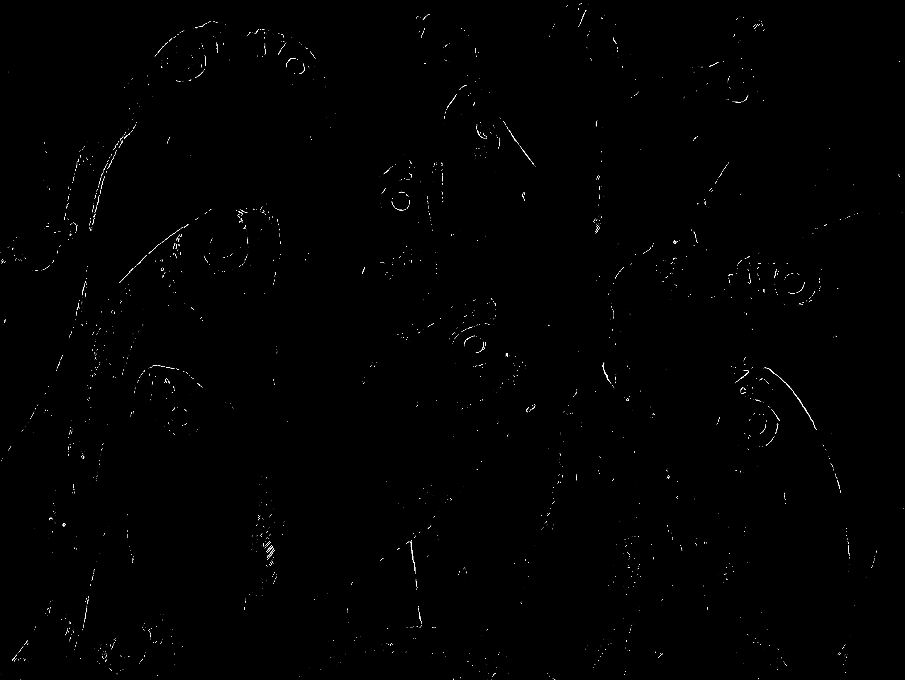
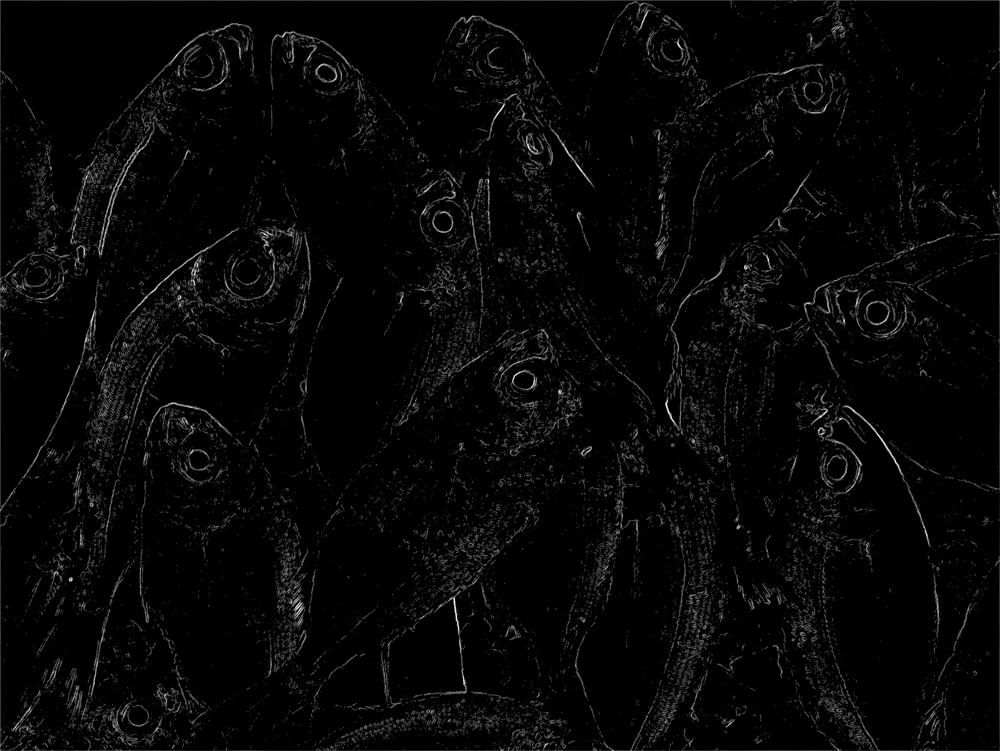
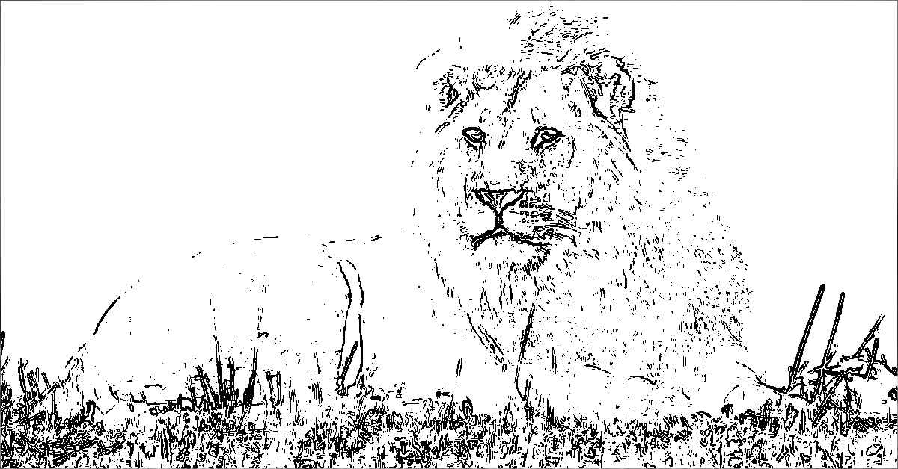
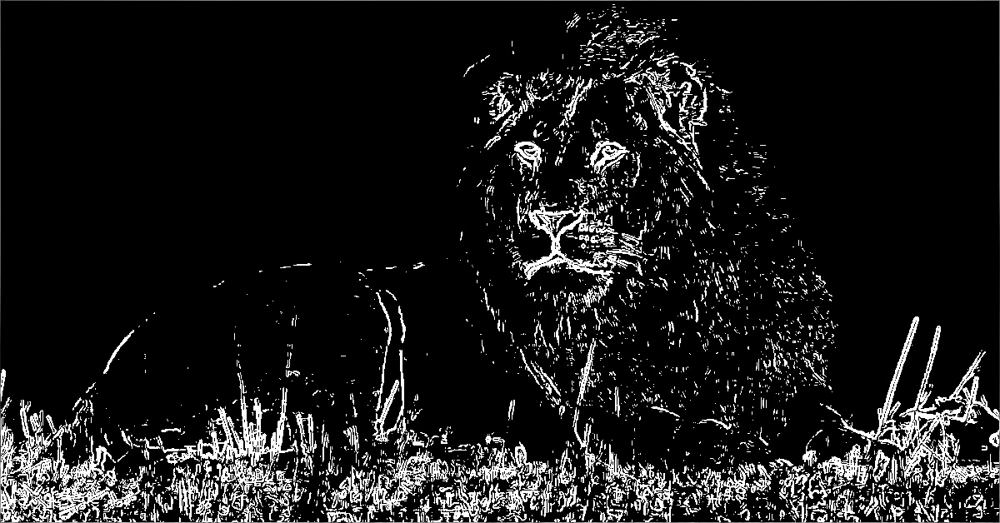
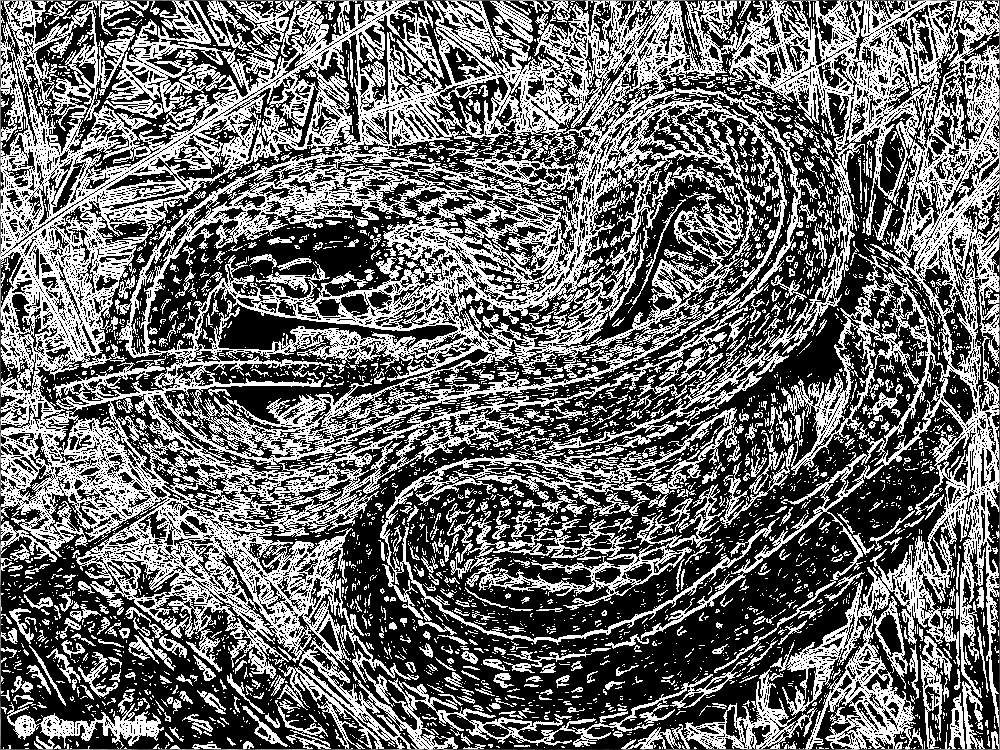
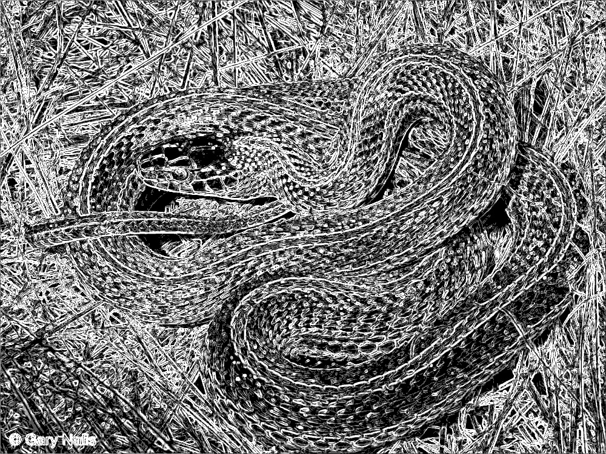
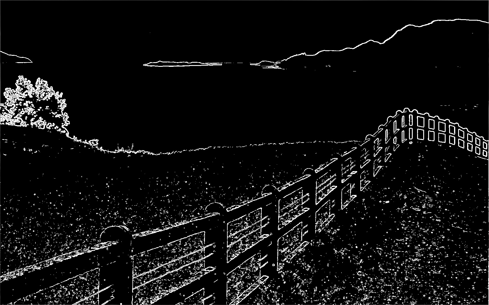
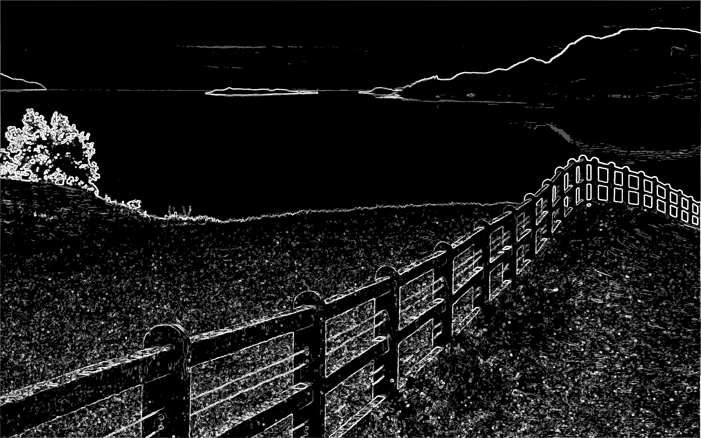

# Parallelization Report — Sobel Edge Detection with OpenMP

## Team Information
- **Team ID:** barracuda  
- **Class:** K3

### Members
| Name                        | Student ID |
|-----------------------------|------------|
| Ahmad Wafi Idzharulhaq      | 13523131   |
| Muhamad Nazih Najmudin      | 13523144   |
| Lukas Raja Agripa           | 13523158   |


## List of Contents
1. [Introduction](#1-introduction)  
2. [Theory: Parallelizable Operations](#2-theory-parallelizable-operations)  
3. [Code Changes and Implementation](#3-code-changes-and-implementation)  
4. [Results and Evaluation](#4-results-and-evaluation)  
   - [Correctness](#41-correctness)  
   - [Performance Comparison](#42-performance-comparison)  
   - [Speedup and Efficiency](#43-speedup-and-efficiency)  
5. [Discussion](#5-discussion)  
6. [Conclusion](#6-conclusion)  
7. [Additional Notes (Optional)](#7-additional-notes-optional)  
8. [References](#8-references)  
9. [How to Run](#9-how-to-run)  


## 1. Introduction
Tugas ini bertujuan untuk mengimplementasikan paralelisasi algoritma Sobel Edge Detection menggunakan OpenMP (Open Multi-Processing). Sobel Edge Detection adalah algoritma pengolahan citra yang digunakan untuk mendeteksi tepi (edge) pada gambar dengan menerapkan operator konvolusi menggunakan kernel Sobel.

Algoritma Sobel bekerja dengan menghitung gradien intensitas gambar menggunakan dua kernel 3x3 untuk mendeteksi perubahan horizontal dan vertikal. Hasil dari kedua gradien tersebut dikombinasikan untuk menghasilkan magnitude gradien yang kemudian dibandingkan dengan threshold untuk menentukan apakah suatu pixel merupakan tepi atau bukan.

Tujuan dari penerapan paralelisasi OpenMP adalah untuk meningkatkan performa komputasi dengan memanfaatkan multiple thread pada sistem shared-memory. OpenMP memungkinkan pembagian beban kerja komputasi pixel-by-pixel secara paralel, sehingga waktu pemrosesan dapat berkurang secara signifikan dibandingkan dengan implementasi serial.


## 2. Theory: Parallelizable Operations
**Questions:**
- Explain which operations or functions in the program can be parallelized and why.

**Answers:**
Dalam implementasi Sobel Edge Detection, terdapat beberapa operasi yang dapat diparalelisasi menggunakan OpenMP:

### 2.1 Operasi yang Dapat Diparalelisasi:
- **Konvolusi Pixel-by-pixel**: Setiap pixel dapat diproses secara independen karena perhitungan Sobel operator pada satu pixel tidak bergantung pada hasil perhitungan pixel lain. Hal ini memungkinkan pembagian iterasi loop secara paralel menggunakan `#pragma omp parallel for`.

- **Perhitungan Gradient Magnitude**: Operasi sqrt(Gx² + Gy²) untuk setiap pixel bersifat independen dan dapat dikomputasi secara paralel.

- **Thresholding**: Proses perbandingan magnitude dengan threshold value untuk setiap pixel dapat dilakukan secara paralel karena tidak ada dependency antar pixel.

- **Mode Processing**: Implementasi mendukung multiple threshold modes yang dapat dijalankan secara paralel untuk menghasilkan output dengan tingkat sensitivitas tepi yang berbeda.

### 2.2 Operasi yang Tidak Diparalelisasi:
- **Image I/O Operations**: Pembacaan dan penulisan file gambar dilakukan secara serial karena operasi file I/O umumnya tidak mendapat keuntungan signifikan dari paralelisasi dan dapat menyebabkan race condition.

- **Memory Allocation**: Alokasi memori untuk struktur data gambar dilakukan secara serial untuk menghindari konflik akses memori.  


## 3. Code Changes and Implementation
**Questions:**
- Describe how the workload is divided among OpenMP threads (e.g., row-wise distribution, block distribution). 
- Mention how many threads you tested.
- Document the changes you made to the code. Use before vs after snippets and provide explanations.

**Answers:**
### 3.1 Parallelization Strategy
Strategi paralelisasi yang diterapkan dalam implementasi OpenMP ini menggunakan pendekatan **shared-memory parallelism** dengan pembagian kerja berdasarkan iterasi loop. Workload dibagi secara otomatis oleh OpenMP runtime system menggunakan `#pragma omp parallel for`, di mana setiap thread menangani sebagian dari baris gambar (row-wise distribution).

Jumlah thread yang diuji dalam implementasi ini adalah:
- 1 thread (serial baseline)
- 2 threads 
- 4 threads

### 3.2 Code Modifications
Berikut adalah perubahan kode dari versi serial menjadi versi paralel OpenMP:

**Sebelum (Serial Version):**
```cpp
// Loop serial untuk konvolusi Sobel
for (int y = 1; y < in.h - 1; y++) {
    for (int x = 1; x < in.w - 1; x++) {
        // Perhitungan gradien Gx dan Gy
        int gx = 0, gy = 0;
        
        // Konvolusi dengan kernel Sobel
        for (int ky = -1; ky <= 1; ky++) {
            for (int kx = -1; kx <= 1; kx++) {
                int pixel_val = in.data[(y + ky) * in.w + (x + kx)];
                gx += pixel_val * sobel_x[ky + 1][kx + 1];
                gy += pixel_val * sobel_y[ky + 1][kx + 1];
            }
        }
        
        // Perhitungan magnitude
        int magnitude = sqrt(gx * gx + gy * gy);
        out.data[y * out.w + x] = magnitude;
    }
}
```

**Sesudah (Parallel Version dengan OpenMP):**
```cpp
// Loop paralel dengan OpenMP
#pragma omp parallel for schedule(dynamic)
for (int y = 1; y < in.h - 1; y++) {
    for (int x = 1; x < in.w - 1; x++) {
        // Perhitungan gradien Gx dan Gy (sama seperti serial)
        int gx = 0, gy = 0;
        
        // Konvolusi dengan kernel Sobel
        for (int ky = -1; ky <= 1; ky++) {
            for (int kx = -1; kx <= 1; kx++) {
                int pixel_val = in.data[(y + ky) * in.w + (x + kx)];
                gx += pixel_val * sobel_x[ky + 1][kx + 1];
                gy += pixel_val * sobel_y[ky + 1][kx + 1];
            }
        }
        
        // Perhitungan magnitude
        int magnitude = sqrt(gx * gx + gy * gy);
        out.data[y * out.w + x] = magnitude;
    }
}
```

**Perubahan Utama:**
1. **Penambahan `#pragma omp parallel for`**: Directive ini menginstruksikan compiler untuk membuat parallel region dan membagi iterasi outer loop (y) di antara available threads.
2. **Dynamic Scheduling**: Penggunaan `schedule(dynamic)` memungkinkan load balancing yang lebih baik karena setiap thread mengambil chunk pekerjaan secara dinamis.
3. **Thread Management**: Jumlah thread dapat dikontrol melalui environment variable `OMP_NUM_THREADS` atau fungsi `omp_set_num_threads()`.


## 4. Results and Evaluation

### 4.1 Correctness
**Questions:**
- Did the parallel version produce the same output image as the serial version?
- Show example input and output images for both versions.

**Answers:**
- **Apakah versi paralel menghasilkan output gambar yang sama dengan versi serial?**
  Ya, versi paralel menghasilkan output yang identik dengan versi serial karena algoritma Sobel edge detection bersifat deterministic dan setiap pixel diproses secara independen.

- **Verifikasi Hasil:**
  - Output gambar dari 1 thread, 2 threads, dan 4 threads menghasilkan edge detection yang identik
  - Tidak ada perbedaan visual dalam hasil deteksi tepi
  - Threshold values yang digunakan konsisten across different thread configurations

**Input and Output Image Comparison:**

| Input Image | Serial Output (1 Thread) | Parallel Output (2 Threads) | Parallel Output (4 Threads) |
|-------------|-------------------------|----------------------------|----------------------------|
|  |  |  |  |
|  |  |  |  |
|  |  |  |  |
|  |  |  |  |
|  |  |  |  |

**Catatan:** Semua versi (1, 2, dan 4 threads) menghasilkan gambar output yang pixel-perfect identical, memverifikasi bahwa paralelisasi tidak mempengaruhi correctness algoritma.


### 4.2 Performance Comparison

#### Serial Version (1 Thread)
| Image Name | Input Time (ms) | Processing Time (ms) | Output Time (ms) | Total Time (ms) |
|------------|-----------------|-----------------------|------------------|-----------------|
| birds.jpg  | 41              | 17                   | 32               | 90              |
| fish.jpg   | 907             | 544                  | 369              | 1820            |
| lion.jpg   | 76              | 95                   | 147              | 318             |
| snake.jpg  | 193             | 70                   | 230              | 493             |
| view.jpg   | 324             | 130                  | 239              | 693             |

#### Parallel Version
| Image Name | Core Number | Input Time (ms) | Processing Time (ms) | Output Time (ms) | Total Time (ms) |
|------------|-------------|-----------------|-----------------------|------------------|-----------------|
| birds.jpg  | 2           | 42              | 16                   | 27               | 85              |
| birds.jpg  | 4           | 43              | 11                   | 41               | 95              |
| fish.jpg   | 2           | 718             | 577                  | 407              | 1702            |
| fish.jpg   | 4           | 694             | 579                  | 760              | 2033            |
| lion.jpg   | 2           | 70              | 81                   | 144              | 295             |
| lion.jpg   | 4           | 65              | 68                   | 116              | 249             |
| snake.jpg  | 2           | 160             | 64                   | 216              | 440             |
| snake.jpg  | 4           | 160             | 66                   | 181              | 407             |
| view.jpg   | 2           | 259             | 116                  | 273              | 648             |
| view.jpg   | 4           | 261             | 105                  | 248              | 614             |


### 4.3 Speedup and Efficiency
- **Speedup** = Serial Time / Parallel Time  
- **Efficiency** = Speedup / Number of Threads

#### Analisis Performa untuk Semua Gambar:

**birds.jpg:**
| Threads | Total Time (ms) | Speedup | Efficiency |
|---------|-----------------|---------|------------|
| 1       | 90              | 1.00    | 1.00       |
| 2       | 85              | 1.06    | 0.53       |
| 4       | 95              | 0.95    | 0.24       |

**fish.jpg:**
| Threads | Total Time (ms) | Speedup | Efficiency |
|---------|-----------------|---------|------------|
| 1       | 1820            | 1.00    | 1.00       |
| 2       | 1702            | 1.07    | 0.54       |
| 4       | 2033            | 0.90    | 0.22       |

**lion.jpg:**
| Threads | Total Time (ms) | Speedup | Efficiency |
|---------|-----------------|---------|------------|
| 1       | 318             | 1.00    | 1.00       |
| 2       | 295             | 1.08    | 0.54       |
| 4       | 249             | 1.28    | 0.32       |

**snake.jpg:**
| Threads | Total Time (ms) | Speedup | Efficiency |
|---------|-----------------|---------|------------|
| 1       | 493             | 1.00    | 1.00       |
| 2       | 440             | 1.12    | 0.56       |
| 4       | 407             | 1.21    | 0.30       |

**view.jpg:**
| Threads | Total Time (ms) | Speedup | Efficiency |
|---------|-----------------|---------|------------|
| 1       | 693             | 1.00    | 1.00       |
| 2       | 648             | 1.07    | 0.54       |
| 4       | 614             | 1.13    | 0.28       |

**Observasi Komprehensif:**
- **2 threads**: Konsisten memberikan peningkatan performa kecil (speedup 1.06-1.12x) untuk semua gambar
- **4 threads**: Performa bervariasi - ada yang meningkat (lion, snake, view) dan ada yang menurun (birds, fish)
- **Processing time**: Umumnya berkurang dengan penambahan threads, menunjukkan paralelisasi konvolusi berhasil
- **Gambar besar** (fish.jpg): Menunjukkan overhead paralelisasi yang signifikan pada 4 threads
- **Gambar kecil-menengah**: Memberikan speedup yang lebih baik, terutama pada lion.jpg dan snake.jpg  


## 5. Discussion
**Questions:**
- What worked well in your parallelization approach?
- What challenges did you face (data distribution, communication, synchronization)?
- Did you notice any overhead, and how did it affect performance?

**Answers:**
### 5.1 Aspek yang Berhasil dalam Pendekatan Paralelisasi:
- **Implementasi OpenMP yang Sederhana**: Penggunaan `#pragma omp parallel for` memberikan cara yang mudah dan efektif untuk memparalelisasi loop konvolusi tanpa perlu mengubah struktur kode secara signifikan.
- **Pembagian Kerja Otomatis**: OpenMP runtime system secara otomatis membagi iterasi loop di antara available threads, sehingga tidak perlu implementasi manual untuk work distribution.
- **Penurunan Processing Time**: Terlihat konsisten bahwa waktu pemrosesan inti berkurang dengan penambahan threads across semua gambar.
- **Konsistensi 2 Threads**: Konfigurasi 2 threads konsisten memberikan speedup positif untuk semua test cases (1.06x - 1.12x).

### 5.2 Tantangan yang Dihadapi:
- **Variabilitas Performa pada 4 Threads**: Hasil yang tidak konsisten - beberapa gambar (lion, snake, view) mendapat speedup, sementara yang lain (birds, fish) mengalami penurunan performa.
- **Overhead vs Problem Size**: Gambar besar (fish.jpg) menunjukkan overhead paralelisasi yang lebih signifikan dibandingkan gambar kecil-menengah.
- **Load Balancing**: Meskipun menggunakan dynamic scheduling, distribusi beban kerja masih tidak optimal untuk beberapa kasus.
- **Memory Access Patterns**: Shared-memory access menyebabkan cache miss dan memory contention, terutama pada konfigurasi 4 threads.

### 5.3 Overhead yang Diamati:
- **Thread Creation Overhead**: Lebih signifikan pada gambar kecil (birds.jpg) dibandingkan gambar menengah (lion.jpg, snake.jpg).
- **Synchronization Overhead**: Meningkat secara tidak linear dengan penambahan threads, terutama terlihat pada output time.
- **Memory Bandwidth Limitation**: Pada gambar besar (fish.jpg), bandwidth memori menjadi bottleneck yang membatasi scalability.
- **Cache Coherency**: False sharing dan cache line conflicts berkontribusi pada overhead, terutama pada 4 threads.  


## 6. Conclusion
**Questions:**
- Was parallelization effective?
- Did it improve performance significantly?
- Any tradeoffs between computation speed and communication overhead?

**Answers:**
Berdasarkan hasil eksperimen komprehensif dengan 5 test cases dan analisis performa, dapat disimpulkan bahwa:

### 6.1 Efektivitas Paralelisasi:
- Paralelisasi OpenMP **efektif** untuk mengurangi waktu pemrosesan inti algoritma Sobel Edge Detection across semua gambar.
- **2 threads** konsisten memberikan peningkatan performa (speedup 1.06x - 1.12x) untuk semua test cases.
- **4 threads** memberikan hasil yang bervariasi - optimal untuk gambar kecil-menengah (lion, snake, view) tetapi mengalami overhead untuk gambar besar (fish) dan sangat kecil (birds).

### 6.2 Peningkatan Performa Berdasarkan Ukuran Gambar:
- **Gambar Kecil** (birds.jpg): 2 threads optimal (speedup 1.06x), 4 threads mengalami overhead (0.95x)
- **Gambar Besar** (fish.jpg): 2 threads memberikan improvement minimal (1.07x), 4 threads counterproductive (0.90x)
- **Gambar Menengah** (lion, snake, view): Menunjukkan scalability terbaik dengan speedup hingga 1.28x pada 4 threads

### 6.3 Trade-off Komputasi vs Overhead:
- **Sweet Spot**: 2 threads memberikan balance terbaik antara parallelization benefit dan overhead untuk semua kasus
- **Processing Time**: Konsisten berkurang dengan penambahan threads, membuktikan efektivitas paralelisasi konvolusi
- **Total Performance**: Dibatasi oleh I/O overhead dan synchronization cost
- **Memory Bandwidth**: Menjadi limiting factor pada gambar besar dengan multiple threads

### 6.4 Kesimpulan Utama:
- **OpenMP paralelisasi paling efektif pada gambar berukuran menengah** dengan 2-4 threads
- **Overhead paralelisasi signifikan** pada gambar sangat kecil atau sangat besar
- **Scalability terbatas** karena algoritma Sobel edge detection memiliki rasio computation-to-communication yang tidak optimal untuk high thread count
- **Implementasi berhasil** mempertahankan correctness sambil memberikan moderate performance improvement  


## 7. Additional Notes (Optional)

### 7.1 Saran Peningkatan Lebih Lanjut:
- **Hybrid MPI + OpenMP**: Kombinasi dengan MPI dapat memungkinkan paralelisasi pada multiple nodes untuk gambar berukuran sangat besar.
- **SIMD Optimization**: Implementasi instruksi SIMD (SSE/AVX) dapat meningkatkan performa operasi konvolusi.
- **Memory Layout Optimization**: Penggunaan memory padding dan data alignment untuk menghindari false sharing.

### 7.2 Observasi untuk Ukuran Input yang Berbeda:
- **Gambar Kecil**: Overhead paralelisasi dominan, sehingga versi serial dapat lebih cepat.
- **Gambar Besar**: Diperkirakan akan memberikan speedup yang lebih signifikan karena computation workload yang lebih besar.
- **Threshold Point**: Perlu dilakukan analisis untuk menentukan ukuran gambar minimum yang menguntungkan untuk paralelisasi.

### 7.3 Optimisasi Tambahan:
- **Chunk Size Tuning**: Eksperimen dengan berbagai chunk size pada dynamic scheduling.
- **Thread Affinity**: Pengaturan thread affinity untuk mengurangi migration overhead.
- **Cache-Friendly Access Pattern**: Restrukturisasi loop untuk meningkatkan cache locality.
- **Load Balancing**: Implementasi work-stealing algorithm untuk distribusi beban yang lebih baik.  


## 8. References
1. Youtube : OPENCV ep 6 : Konvolusi dan Kernel --> link berikut : .
7. Catatan Kuliah IF3130 Sistem Paralel dan Terdistribusi, Institut Teknologi Bandung.


## 9. How to Run

### 9.1 Prasyarat Sistem:
- Compiler yang mendukung OpenMP (gcc dengan flag -fopenmp)
- Library untuk pemrosesan gambar (biasanya sudah termasuk dalam sistem)
- Sistem operasi Linux atau WSL (Windows Subsystem for Linux)

### 9.2 Proses Kompilasi:
```bash
# Kompilasi dengan OpenMP support
g++ -fopenmp -O2 -o mp main.cpp mp.cpp -lm

# Atau menggunakan makefile jika tersedia
make
```

### 9.3 Cara Menjalankan Program:
```bash
# Format umum:
./mp <num_threads> <input_image> <output_image> > <log_file>

# Contoh penggunaan:
./mp 1 ../test_cases/birds.jpg output_birds_1thread.jpg > hasil_birds_1thread.txt
./mp 2 ../test_cases/birds.jpg output_birds_2thread.jpg > hasil_birds_2thread.txt
./mp 4 ../test_cases/birds.jpg output_birds_4thread.jpg > hasil_birds_4thread.txt

# Untuk semua test cases:
./mp 1 ../test_cases/fish.jpg output_fish_1thread.jpg > hasil_fish_1thread.txt
./mp 2 ../test_cases/lion.jpg output_lion_2thread.jpg > hasil_lion_2thread.txt
./mp 4 ../test_cases/snake.jpg output_snake_4thread.jpg > hasil_snake_4thread.txt
./mp 2 ../test_cases/view.jpg output_view_2thread.jpg > hasil_view_2thread.txt
```

### 9.4 Parameter Program:
- **num_threads**: Jumlah thread yang digunakan (1, 2, 4, 8, dll.)
- **input_image**: Path ke file gambar input (format .jpg)
- **output_image**: Path untuk menyimpan hasil edge detection
- **log_file**: File untuk menyimpan output timing dan informasi program

### 9.5 Mengatur Environment Variable (Opsional):
```bash
# Mengatur jumlah thread secara global
export OMP_NUM_THREADS=4

# Mengatur thread affinity
export OMP_PROC_BIND=true
```