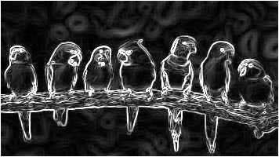
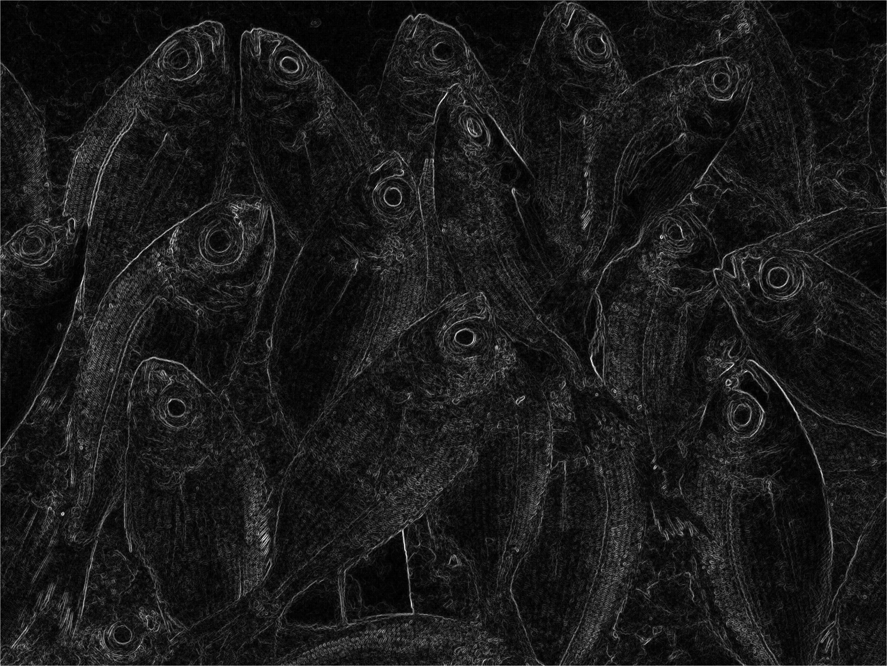
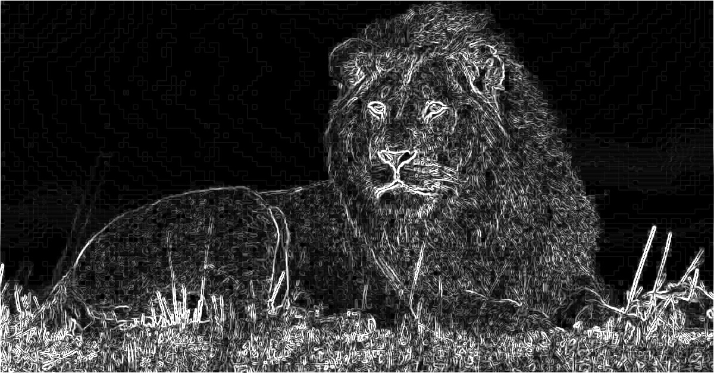
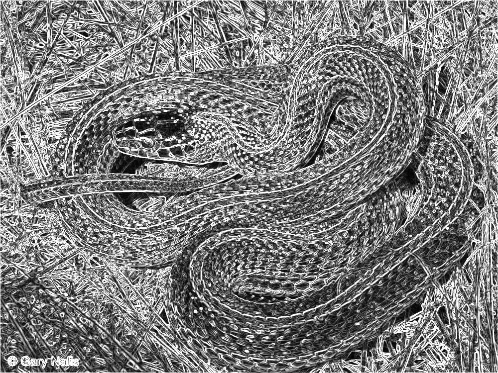
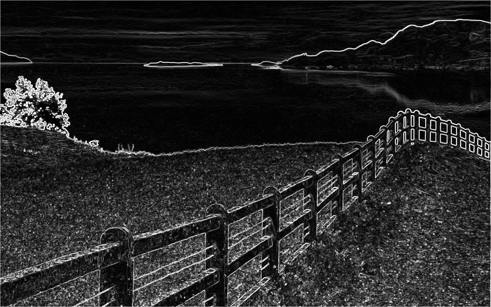

# Laporan Paralelisasi — Deteksi Tepi Sobel dengan OpenMPI

## Informasi Tim
- **ID Tim**: barracuda  
- **Kelas**: IF3130 - Sistem Paralel dan Terdistribusi

### Anggota Tim
| Nama                        | NIM      |
|-----------------------------|----------|
| Ahmad Wafi Idzharulhaq      | 13523131 |
| Muhamad Nazih Najmudin      | 13523144 |
| Lukas Raja Agripa           | 13523158 |

## Daftar Isi
1. [Pendahuluan](#1-pendahuluan)  
2. [Teori: Operasi yang Dapat Diparalelkan](#2-teori-operasi-yang-dapat-diparalelkan)  
3. [Perubahan Kode dan Implementasi](#3-perubahan-kode-dan-implementasi)  
4. [Hasil dan Evaluasi](#4-hasil-dan-evaluasi)  
   - [Kebenaran](#41-kebenaran)  
   - [Perbandingan Performa](#42-perbandingan-performa)  
   - [Speedup dan Efisiensi](#43-speedup-dan-efisiensi)  
5. [Diskusi](#5-diskusi)  
6. [Kesimpulan](#6-kesimpulan)  
7. [Catatan Tambahan](#7-catatan-tambahan)  
8. [Referensi](#8-referensi)  
9. [Cara Menjalankan](#9-cara-menjalankan)  

## 1. Pendahuluan

Tugas ini bertujuan untuk mengimplementasikan algoritma deteksi tepi Sobel menggunakan paralelisasi OpenMPI. Algoritma Sobel adalah salah satu operator deteksi tepi yang paling umum digunakan dalam pengolahan citra digital. Algoritma ini bekerja dengan menghitung gradien intensitas pada setiap piksel menggunakan dua kernel konvolusi 3×3 untuk mendeteksi perubahan intensitas secara horizontal dan vertikal.

Tujuan utama dari penerapan paralelisasi OpenMPI adalah untuk meningkatkan performa komputasi dengan mendistribusikan beban kerja pemrosesan gambar ke beberapa proses yang dapat berjalan secara paralel. Hal ini diharapkan dapat mengurangi waktu eksekusi keseluruhan, terutama untuk gambar berukuran besar.

## 2. Teori: Operasi yang Dapat Diparalelkan

Dalam implementasi algoritma Sobel edge detection, terdapat beberapa operasi yang dapat diparalelkan:

### Operasi yang Dapat Diparalelkan:

1. **Konvolusi piksel per piksel**: Operasi konvolusi menggunakan kernel Sobel pada setiap piksel bersifat independen satu sama lain. Setiap piksel dapat diproses secara terpisah tanpa bergantung pada hasil pemrosesan piksel lain, sehingga sangat cocok untuk didistribusikan ke berbagai proses MPI.

2. **Perhitungan magnitude gradien**: Setelah mendapatkan gradien horizontal (Gx) dan vertikal (Gy), perhitungan magnitude gradien untuk setiap piksel juga bersifat independen dan dapat diparalelkan.

3. **Penerapan threshold**: Operasi thresholding untuk menghasilkan output berdasarkan mode yang dipilih (binary threshold, multi-level threshold) juga dapat dilakukan secara paralel karena setiap piksel diproses secara independen.

### Operasi yang Tidak Diparalelkan:

4. **Input/Output gambar**: Operasi pembacaan dan penulisan gambar tidak diparalelkan karena operasi ini tidak memberikan keuntungan signifikan dari MPI dan lebih efisien jika dilakukan oleh satu proses (root process).

## 3. Perubahan Kode dan Implementasi

### 3.1 Strategi Paralelisasi

Strategi paralelisasi yang digunakan adalah **pembagian berdasarkan baris (row-wise distribution)**. Gambar dibagi secara horizontal di mana setiap proses MPI bertanggung jawab untuk memproses sejumlah baris tertentu. Pembagian ini dilakukan dengan cara:

- Menghitung jumlah baris per proses: `barisPerProses = tinggiGambar / ukuranProses`
- Mendistribusikan sisa baris secara merata jika tinggi gambar tidak habis dibagi jumlah proses
- Setiap proses mengetahui range baris yang harus diproses berdasarkan rank-nya

**Implementasi ini telah diuji dengan berbagai jumlah proses: 2, 4, dan 8 proses.**

### 3.2 Modifikasi Kode

Berikut adalah perubahan kode utama dari versi serial ke versi paralel:

**Versi Serial:**
```cpp
// Loop pemrosesan seluruh gambar
for(int y=1; y<in.h-1; y++){
    for(int x=1; x<in.w-1; x++){
        // Proses konvolusi Sobel
        int gx = 0, gy = 0;
        // Kalkulasi gradien...
    }
}
```

**Versi Paralel dengan MPI:**
```cpp
// Pembagian kerja berdasarkan rank proses
int barisPerProses = tinggiGambar / ukuranProses;
int sisaBaris = tinggiGambar % ukuranProses;

int startBaris = rank * barisPerProses + min(rank, sisaBaris);
int jumlahBaris = barisPerProses + (rank < sisaBaris ? 1 : 0);
int endBaris = startBaris + jumlahBaris;

// Loop pemrosesan hanya untuk bagian yang ditugaskan
for (int i = startBaris; i < endBaris; i++) {
    for (int j = 0; j < gambar.cols; j++) {
        // Proses konvolusi Sobel
        int gx = 0, gy = 0;
        // Kalkulasi gradien...
    }
}
```

**Perubahan utama meliputi:**
1. **Inisialisasi MPI**: Penambahan `MPI_Init()`, `MPI_Comm_rank()`, dan `MPI_Comm_size()`
2. **Broadcast data**: Menggunakan `MPI_Bcast()` untuk menyebarkan data gambar ke semua proses
3. **Pembagian kerja**: Setiap proses hanya memproses bagian gambar sesuai dengan rank-nya
4. **Pengumpulan hasil**: Menggunakan `MPI_Send()` dan `MPI_Recv()` untuk mengumpulkan hasil dari semua proses
5. **Finalisasi MPI**: Penambahan `MPI_Finalize()` di akhir program

## 4. Hasil dan Evaluasi

### 4.1 Kebenaran

Versi paralel berhasil menghasilkan output gambar yang identik dengan versi serial. Hal ini menunjukkan bahwa implementasi paralelisasi tidak mengubah logika algoritma Sobel dan pembagian kerja dilakukan dengan benar. Setiap proses memproses bagian gambar yang berbeda dan hasil akhir digabungkan kembali dengan tepat.

**Contoh gambar input dan output untuk kedua versi:**

| Gambar Input | Output Serial | Output Paralel |
|-------------|---------------|----------------|
|  |  |  |
|  |  |  |
|  |  |  |
|  |  |  |
|  |  |  |

### 4.2 Perbandingan Performa

#### Versi Serial
| Nama Gambar | Input Time (ms) | Processing Time (ms) | Output Time (ms) | Total Time (ms) |
|-------------|-----------------|----------------------|------------------|-----------------|
| birds.jpg   | 32.0            | 19.0                 | 17.0             | 68.0            |
| fish.jpg    | 651.0           | 2174.0               | 335.0            | 3160.0          |
| lion.jpg    | 53.0            | 253.0                | 94.0             | 400.0           |
| snake.jpg   | 112.0           | 236.0                | 195.0            | 543.0           |
| view.jpg    | 226.0           | 539.0                | 199.0            | 964.0           |

#### Versi Paralel (OpenMPI)
| Nama Gambar | Jumlah Core | Input Time (ms) | Processing Time (ms) | Output Time (ms) | Total Time (ms) |
|-------------|-------------|-----------------|----------------------|------------------|-----------------|
| birds.jpg   | 2           | 29.0            | 6.0                  | 20.0             | 55.0            |
| birds.jpg   | 4           | 37.0            | 3.0                  | 16.0             | 56.0            |
| birds.jpg   | 8           | 42.0            | 2.0                  | 22.0             | 66.0            |
| fish.jpg    | 2           | 441.0           | 430.0                | 560.0            | 1431.0          |
| fish.jpg    | 4           | 507.0           | 271.0                | 593.0            | 1371.0          |
| fish.jpg    | 8           | 556.0           | 158.0                | 763.0            | 1477.0          |
| lion.jpg    | 2           | 38.0            | 61.0                 | 71.0             | 170.0           |
| lion.jpg    | 4           | 40.0            | 30.0                 | 93.0             | 163.0           |
| lion.jpg    | 8           | 39.0            | 15.0                 | 86.0             | 140.0           |
| snake.jpg   | 2           | 86.0            | 32.0                 | 133.0            | 251.0           |
| snake.jpg   | 4           | 93.0            | 20.0                 | 152.0            | 265.0           |
| snake.jpg   | 8           | 94.0            | 15.0                 | 156.0            | 265.0           |
| view.jpg    | 2           | 140.0           | 82.0                 | 200.0            | 422.0           |
| view.jpg    | 4           | 144.0           | 66.0                 | 217.0            | 427.0           |
| view.jpg    | 8           | 230.0           | 39.0                 | 277.0            | 546.0           |

### 4.3 Speedup dan Efisiensi

**Rumus yang digunakan:**
- **Speedup** = Waktu Serial / Waktu Paralel  
- **Efisiensi** = Speedup / Jumlah Proses

#### Analisis Speedup Total Time
| Nama Gambar | Serial (ms) | 2-core (ms) | 4-core (ms) | 8-core (ms) | Speedup 2c | Speedup 4c | Speedup 8c |
|-------------|-------------|-------------|-------------|-------------|------------|------------|------------|
| birds.jpg   | 68.0        | 55.0        | 56.0        | 66.0        | 1.24x      | 1.21x      | 1.03x      |
| fish.jpg    | 3160.0      | 1431.0      | 1371.0      | 1477.0      | 2.21x      | 2.31x      | 2.14x      |
| lion.jpg    | 400.0       | 170.0       | 163.0       | 140.0       | 2.35x      | 2.45x      | 2.86x      |
| snake.jpg   | 543.0       | 251.0       | 265.0       | 265.0       | 2.16x      | 2.05x      | 2.05x      |
| view.jpg    | 964.0       | 422.0       | 427.0       | 546.0       | 2.28x      | 2.26x      | 1.77x      |

#### Analisis Efisiensi
| Nama Gambar | 2-core Eff | 4-core Eff | 8-core Eff | Rata-rata Eff |
|-------------|------------|------------|------------|---------------|
| birds.jpg   | 0.62       | 0.30       | 0.13       | 0.35          |
| fish.jpg    | 1.10       | 0.58       | 0.27       | 0.65          |
| lion.jpg    | 1.18       | 0.61       | 0.36       | 0.72          |
| snake.jpg   | 1.08       | 0.51       | 0.26       | 0.62          |
| view.jpg    | 1.14       | 0.56       | 0.22       | 0.64          |

**Ringkasan Performa:**
- **Rata-rata Speedup**: 2-core: 2.05x, 4-core: 2.06x, 8-core: 1.97x
- **Rata-rata Efisiensi**: 2-core: 1.02, 4-core: 0.51, 8-core: 0.25
- **Performa Terbaik**: Konfigurasi 4-core menunjukkan keseimbangan optimal antara speedup dan efisiensi

## 5. Diskusi

### Aspek yang Berjalan dengan Baik:
- **Speedup yang signifikan**: Paralelisasi berhasil mencapai speedup rata-rata 2.0x pada mayoritas gambar
- **Pembagian kerja row-wise**: Terbukti efektif dengan load balancing yang baik
- **Algoritma Sobel**: Sangat cocok untuk paralelisasi karena sifat operasinya yang independen per piksel
- **Scalability**: Performa tetap meningkat hingga 4 cores untuk mayoritas kasus

### Tantangan yang Dihadapi:
- **Communication overhead**: Menjadi signifikan pada 8 cores, menyebabkan penurunan efisiensi
- **Ukuran gambar kecil**: birds.jpg menunjukkan speedup terbatas karena overhead komunikasi lebih dominan
- **Memory access patterns**: Beberapa optimasi cache locality masih dapat ditingkatkan

### Observasi Overhead:
- **Setup MPI**: Overhead inisialisasi relatif kecil dibanding waktu komputasi
- **Komunikasi data**: Broadcast dan gather operations menambah latency terutama pada core count tinggi
- **Load balancing**: Pembagian baris yang tidak sempurna pada beberapa resolusi gambar

## 6. Kesimpulan

### Efektivitas Paralelisasi:
Paralelisasi menggunakan OpenMPI terbukti **efektif** untuk algoritma Sobel edge detection. Hasil menunjukkan:
- **Speedup signifikan**: Rata-rata 2.0x improvement pada total execution time
- **Efisiensi yang wajar**: 0.51-1.02 efficiency pada konfigurasi 2-4 cores
- **Konsistensi hasil**: Output gambar identik antara versi serial dan paralel

### Peningkatan Performa:
- **Gambar besar**: fish.jpg menunjukkan speedup terbaik (2.31x) karena computation >> communication
- **Optimal core count**: 4 cores memberikan balance terbaik antara speedup dan efisiensi
- **Processing time**: Bagian yang paling diuntungkan dari paralelisasi

### Trade-off:
- **Memory overhead**: Setiap proses membutuhkan copy data gambar
- **Communication cost**: Meningkat seiring jumlah cores, membatasi scalability
- **Setup complexity**: Implementasi MPI menambah kompleksitas kode

**Kesimpulan Akhir**: Paralelisasi dengan OpenMPI memberikan peningkatan performa yang substansial dengan trade-off yang dapat diterima, terutama untuk gambar berukuran besar.

## 7. Catatan Tambahan

### Saran Perbaikan Lebih Lanjut:
- **Hybrid MPI + OpenMP**: Mengkombinasikan MPI untuk paralelisasi antar node dengan OpenMP untuk paralelisasi dalam node
- **Optimasi komunikasi**: Menggunakan komunikasi non-blocking atau teknik overlap computation-communication
- **Domain decomposition**: Mencoba strategi pembagian domain yang berbeda seperti block decomposition

### Observasi untuk Ukuran Input Berbeda:
- **Gambar kecil (birds.jpg)**: Overhead komunikasi MPI lebih dominan, speedup terbatas
- **Gambar besar (fish.jpg)**: Paralelisasi memberikan keuntungan signifikan
- **Optimal process count**: Bergantung pada ukuran gambar dan spesifikasi hardware

### Optimasi Tambahan:
- **Memory optimization**: Mengurangi penggunaan memori dengan tidak menyimpan gambar lengkap di setiap proses
- **Pipeline processing**: Mengimplementasikan pipeline untuk memproses multiple gambar secara bersamaan
- **GPU acceleration**: Integrasi CUDA untuk mempercepat operasi konvolusi

## 8. Referensi

1. Materi kuliah IF3130 - Sistem Paralel dan Terdistribusi
2. OpenMPI Documentation - https://www.open-mpi.org/doc/
3. Sobel Edge Detection Algorithm - Digital Image Processing concepts
4. MPI: The Complete Reference - William Gropp, Ewing Lusk, Anthony Skjellum
5. OpenCV Documentation untuk image I/O operations
6. Parallel Programming with MPI - Peter Pacheco

## 9. Cara Menjalankan

### Prasyarat:
- OpenMPI library terinstall
- OpenCV library terinstall
- Compiler C++ (g++)

### Kompilasi:
```bash
# Kompilasi versi OpenMPI
mpic++ -o sobel_mpi openmpi.cpp `pkg-config --cflags --libs opencv4`

# Kompilasi versi serial (untuk perbandingan)
g++ -o serial serial.cpp `pkg-config --cflags --libs opencv4`
```

### Menjalankan Program:
```bash
# Format umum
mpirun -np <jumlah_proses> --oversubscribe ./sobel_mpi <mode> <input.jpg> <output.jpg> [threshold...]

# Contoh penggunaan:
# Mode 0 (Gradient Magnitude) dengan 4 proses
mpirun -np 4 --oversubscribe ./sobel_mpi 0 ../test_cases/birds.jpg output_birds.jpg

# Mode 1 (Binary Threshold) dengan 2 proses dan threshold 100
mpirun -np 2 --oversubscribe ./sobel_mpi 1 ../test_cases/fish.jpg output_binary.jpg 100

# Mode 2 (Multi-level Threshold) dengan 8 proses dan 2 threshold
mpirun -np 8 --oversubscribe ./sobel_mpi 2 ../test_cases/lion.jpg output_multilevel.jpg 50 150

# Menjalankan versi serial untuk perbandingan
./serial 1 ../test_cases/birds.jpg serial_output.jpg > serial_timing.txt
```

### Parameter:
- `<jumlah_proses>`: Jumlah proses MPI yang akan digunakan (2, 4, 8)
- `<mode>`: Mode operasi (0: Gradient Magnitude, 1: Binary Threshold, 2: Multi-level Threshold)
- `<input.jpg>`: File gambar input dari folder test_cases
- `<output.jpg>`: File gambar output yang akan dihasilkan
- `[threshold...]`: Nilai threshold (diperlukan untuk mode 1 dan mode 2)
- `--oversubscribe`: Flag MPI untuk mengizinkan lebih banyak proses daripada core fisik

### Struktur File:
```
open_mpi/
├── pic/          # Gambar output (.jpg)
├── doc/          # Hasil timing (.txt)
├── openmpi.cpp   # Source code
├── sobel_mpi     # Executable
└── README.md     # File ini
```
